# up to stage

> Unfold Pages to Structured, Trusted, Accessible Guidance for Everyone.

**up to stage**는 하나의 기회나 행정 절차를 이해하기 위해 여러 웹페이지와 PDF·HWP·HWPX·XLSX 문서를 직접 열고 비교해야 하는 문제를 해결하는 Chrome Extension 기반 Document Intelligence 제품입니다.

이 프로젝트는 **JunctionX Korea 2026 — GOODMORNING 팀**에서 제작합니다.

우리의 출발점은 단순합니다.

> **Opportunity for Everyone.**  
> 정보가 존재하는 것과, 누구나 실제로 발견하고 이해하고 검증하고 행동할 수 있는 것은 다릅니다.

up to stage는 현재 보고 있는 웹페이지와 그 페이지에 연결된 여러 문서를 하나의 Case로 묶고, 문서별 역할과 구조를 이해한 뒤 사용자에게 필요한 핵심 안내·개인화된 조건 확인·원문 근거·접근 가능한 문서 탐색 경험을 제공합니다.

---

## 왜 만들었나요?

장학금, 공공지원사업, 학교 행정, 인턴십, 교환학생, 기숙사, 각종 신청 절차처럼 실제 기회는 이미 존재합니다. 문제는 그 안내가 한곳에 있지 않다는 점입니다.

한 번의 신청을 위해 사용자는 보통 다음을 직접 해야 합니다.

- 공고 페이지를 읽고
- 연결된 여러 첨부문서를 발견하고
- PDF, HWP, XLSX를 각각 열어보고
- 어떤 문서가 공고인지, 체크리스트인지, 신청서인지 판단하고
- 자격, 일정, 제출서류, 예외, 작성 규칙을 비교하고
- 자신의 조건에 대입해 지원 가능성을 판단하고
- 중요한 판단이 실제로 어디에서 나온 것인지 다시 원문을 찾아 확인합니다.

up to stage는 이 과정을 다음과 같이 바꿉니다.

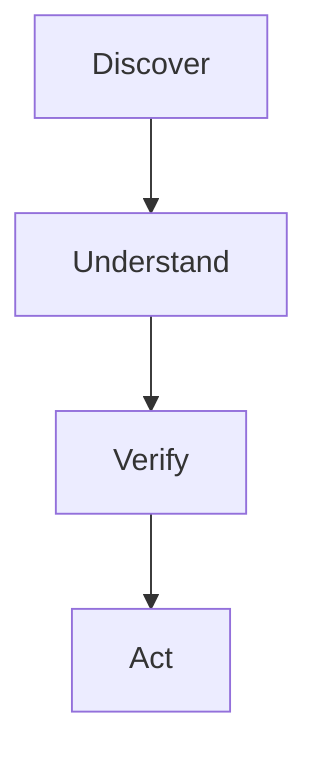

즉, **Many Documents → One Decision**을 만드는 것이 핵심입니다.

---

# 핵심 경험

## 1. 현재 페이지에서 바로 시작

Chrome Extension은 등록된 URL Rule 또는 현재 페이지의 문서 구조를 기반으로 분석 가능한 맥락을 감지합니다.

P0에서는 데모 안정성을 위해 **URL Rule 기반 Contextual Overlay**를 사용합니다.

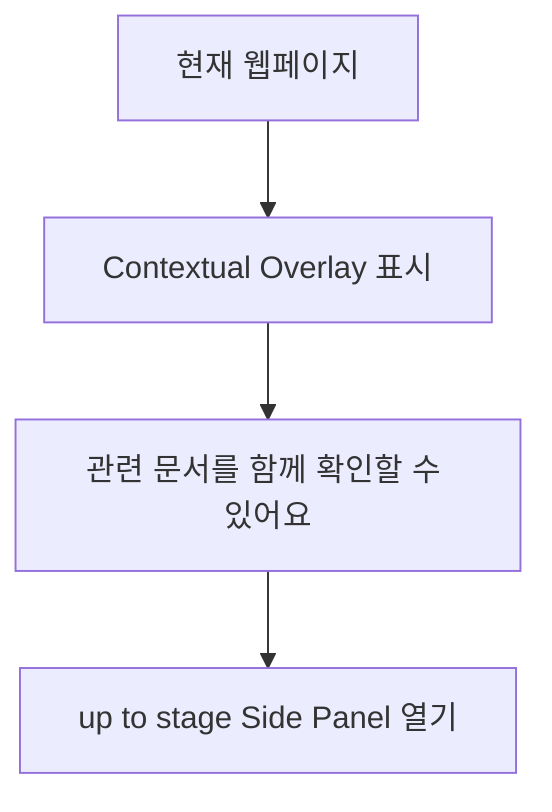

Overlay는 제품 본체가 아니라 현재 페이지에서 분석 경험으로 진입하는 가벼운 trigger입니다.

---

## 2. 관련 문서를 발견하고 사용자가 직접 선택

현재 페이지에서 PDF, HWP, HWPX, XLSX, DOCX, PPTX 등의 첨부 링크를 찾습니다.

발견했다고 바로 외부로 전송하지 않습니다.

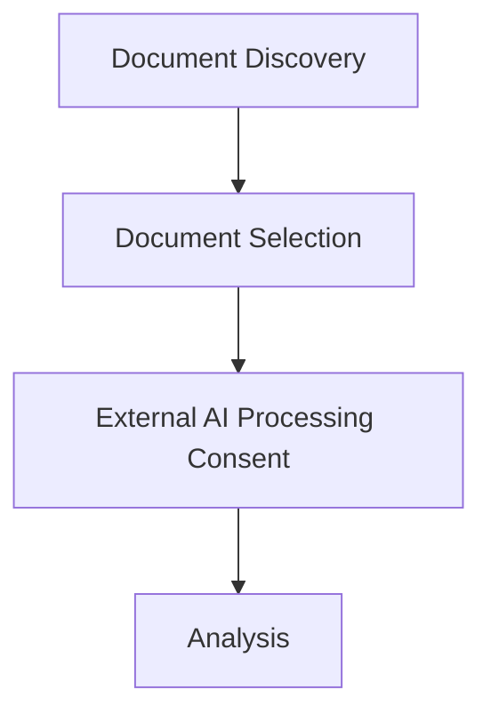

사용자가 선택한 문서만 Upstage로 전달합니다.

---

## 3. 문서마다 다른 방식으로 이해

up to stage는 모든 파일에 동일한 Extraction Schema를 적용하지 않습니다.

문서의 역할을 먼저 판단한 뒤, 역할에 맞는 Extract를 연결합니다.

현재 확정된 범용 문서 역할은 다음과 같습니다.

| 역할                     | 설명                                             |
| ------------------------ | ------------------------------------------------ |
| `primary_notice`         | 핵심 조건, 일정, 제출물, 주의사항                |
| `requirements_checklist` | 조건, 제외조건, 확인 질문                        |
| `application_form`       | 필수 입력, 서명, 첨부, 형식 제약                 |
| `procedure_guide`        | 절차, 제출 채널, 완료 확인                       |
| `reference_material`     | 대량 재추출하지 않고 Search/lookup 대상으로 사용 |
| `amendment_update`       | 변경 전·후와 대체 관계 확인                      |
| `other`                  | 기타 문서                                        |

이 구조 덕분에 특정 장학금 하나가 아니라 다양한 공공·행정·지원 문서 Workflow로 확장할 수 있습니다.

---

## 4. 바로 읽을 수 있는 Initial Guidance

Agent 처리가 끝나면 첫 화면에서 바로 다음을 보여줍니다.

- 주요 조건
- 가장 가까운 마감
- 필수 제출물
- 중요한 주의사항
- 다음 행동

사용자는 먼저 전체 문서를 읽지 않아도 무엇을 확인해야 하는지 알 수 있습니다.

---

## 5. "내가 해당되나요?"를 즉시 확인

Quick Question은 사용자가 버튼을 누른 뒤 새로 생성하지 않습니다.

Agent가 문서를 분석할 때 미리 다음을 추출합니다.

| 필드              | 설명                                               |
| ----------------- | -------------------------------------------------- |
| `key`             | 질문 식별자                                        |
| `label`           | 사용자에게 보이는 문구                             |
| `input type`      | 입력 형식 (select, text, number, date, boolean 등) |
| `required`        | 필수 응답 여부                                     |
| `options`         | 선택형 질문의 선택지                               |
| `rule`            | 평가 규칙                                          |
| `source location` | 근거 Source ID                                     |

예를 들어 `type=select`이고 `options`가 존재하면 해당 선택지를 그대로 동적 Form으로 렌더링합니다.

```text
재학 중인 학교 유형
[ 서울 소재 ▼ ]

왜 묻나요?
지원 가능 여부가 학교 소재지와 거주 조건에 따라 달라집니다.
```

숫자 비교, 날짜, boolean, 단순 선택 조건은 가능한 한 deterministic하게 평가하고, 자연어 복합조건이나 예외만 Solar에 맡깁니다.

---

## 6. 모든 답변은 원문으로 돌아갈 수 있어야 함

제품의 가장 중요한 기술 원칙입니다.

> **Every Answer Has a Place.**

Parse 결과의 원문 element에 up to stage가 자체적으로 `Source ID`를 부여합니다.

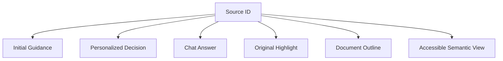

모델이 Source ID를 새로 만들게 하지 않습니다.
Solar도 이미 존재하는 Source ID 중 근거를 선택하는 역할만 합니다.

이를 통해 사용자는 AI가 제공한 판단을 믿기만 하는 것이 아니라, **실제 문서의 어느 페이지·어느 문장에서 나온 판단인지 다시 확인할 수 있습니다.**

---

## 7. 같은 문서를 여러 방식으로 탐색

독립 Viewer Page는 다음 세 영역으로 구성됩니다.

| 영역                            | 역할                | 너비     |
| ------------------------------- | ------------------- | -------- |
| Document Outline                | 문서 구조 기반 목차 | ~224px   |
| Original Document Viewer        | 원본 문서 렌더링    | flexible |
| up to stage Guidance / Evidence | 안내와 근거         | ~443px   |

Viewer에서는 다음을 제공합니다.

- 문서 구조 기반 Outline
- 원본 문서 렌더링
- Source 위치 Highlight
- 요약 ↔ 원문 번호 연결
- Source 클릭 시 정확한 위치 이동
- 구조 보기
- 원문 보기
- 접근성 보기

접근성은 별도 장애인 모드가 아니라 **같은 문서를 다른 방식으로 탐색할 수 있게 만드는 제품의 기본 구조**입니다.

---

# Architecture

up to stage는 **Studio가 문서를 이해하고, Extension이 Case와 사용자 경험을 조직하는 구조**로 설계되어 있습니다.

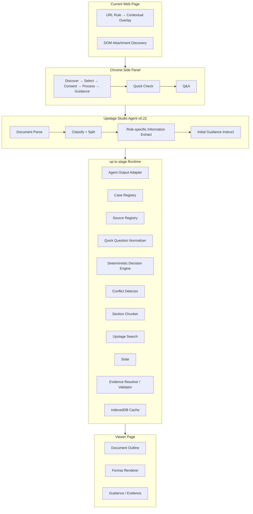

---

# Upstage Technology

## Studio Agent v0.22

현재 Agent는 확정본으로 취급합니다.

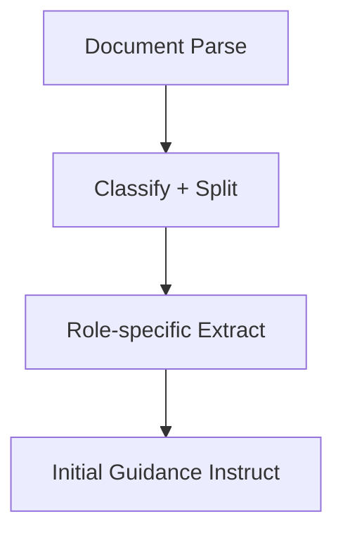

### Document Parse

여러 문서 포맷을 machine-readable structure로 변환하고, 문서 element와 페이지·좌표 정보를 확보합니다.

### Classify

문서마다 역할을 판단합니다.

### Information Extract

각 문서 역할에 필요한 정보만 schema 기반으로 추출합니다.

### Instruct

추출된 핵심 정보를 사용자가 처음 보는 Initial Guidance로 정리합니다.

Studio의 책임은 여기까지입니다.

---

# Retrieval & Reasoning

긴 문서나 reference material을 모든 질문마다 다시 LLM에 넣지 않습니다.

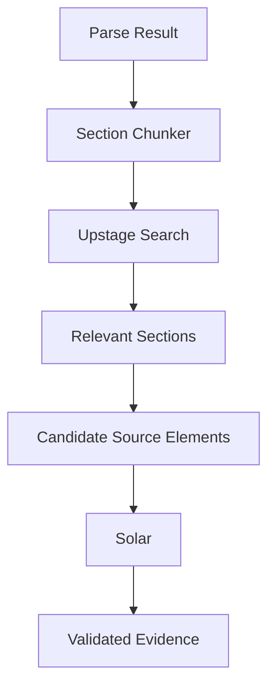

Section boundary는 다음 순서로 판단합니다.

| 우선순위 | 기준                                                      |
| -------- | --------------------------------------------------------- |
| 1        | Heading                                                   |
| 2        | Numbered structure (`1.`, `가.`, `①`, `제1조`, `붙임` 등) |
| 3        | Table / List                                              |
| 4        | Length                                                    |

핵심 역할 분담은 다음과 같습니다.

> **Search finds where to look. Solar finds what matters.**

Search 결과 자체는 최종 근거가 아닙니다. Search가 좁힌 범위의 실제 Parse Source 중에서 Solar가 근거를 선택합니다.

---

# Evidence Model

Canonical source 구조의 예시는 다음과 같습니다.

```ts
interface SourceRecord {
  sourceId: string;
  caseId: string;
  documentId: string;

  page: number;
  elementId: string | number;
  category: string;

  text: string;

  polygon?: Point[];
  wordCoordinates?: Point[][];

  confidence?: number;
  semanticNodeId?: string;
}
```

Source ID 예시:

```text
src:doc_abc:p2:e35
```

다음은 Source로 인정하지 않습니다.

- Search를 위해 생성한 제목
- Retrieval용 summary
- AI가 생성한 설명 문장
- 모델이 임의로 생성한 ID

---

# Document Viewer

Viewer는 문서를 편집하는 도구가 아닙니다.

목표는 **원본 표현 + 정확한 근거 위치 + 구조적 탐색**입니다.

| 포맷          | 구현 방향                                     |
| ------------- | --------------------------------------------- |
| PDF           | `pdfjs-dist`                                  |
| HWP / HWPX    | `@rhwp/core` 기반 readonly renderer           |
| XLSX          | SheetJS CE + readonly grid                    |
| Large XLSX    | `@tanstack/react-virtual`                     |
| Semantic View | Parse Elements → 자체 React semantic renderer |

PDF에서는 가능하면 Canvas + Text Layer + Evidence Overlay를 사용합니다.

HWP/HWPX는 편집 기능을 구현하지 않으며, element-level source navigation을 우선합니다.

XLSX는 텍스트 드래그보다 sheet/cell 기반 탐색을 우선합니다.

---

# Accessibility

up to stage는 접근성을 별도의 부가 기능으로 다루지 않습니다.

문서에 대해 세 레이어를 구분합니다.

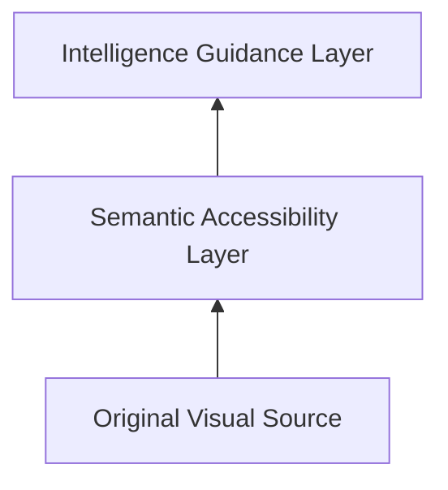

Parse element를 Semantic Tree로 재구성합니다.

| Parse element  | Semantic tag |
| -------------- | ------------ |
| heading        | `h1~h6`      |
| paragraph      | `p`          |
| ordered list   | `ol`         |
| unordered list | `ul`         |
| table          | `table`      |
| header cell    | `th`         |
| figure         | `figure`     |
| caption        | `figcaption` |

Raw Parse HTML을 그대로 사용자에게 렌더링하는 방식이 아니라, 자체 Semantic Normalizer와 React renderer를 사용합니다.

목표는 "완전한 문서 remediation"을 주장하는 것이 아니라:

> 문서의 논리 구조를 복원해 키보드와 스크린 리더로 탐색 가능한 Semantic View를 제공하는 것

입니다.

---

# Chrome Extension Architecture

## Entry Points

```text
entrypoints/
├── background/
├── content/
├── sidepanel/
├── viewer/
└── options/
```

### Background Service Worker

짧은 event routing만 담당합니다.

| 책임                | 설명                             |
| ------------------- | -------------------------------- |
| Side Panel open     | 탭에서 Side Panel 열기           |
| Tab event           | 탭 이벤트 라우팅                 |
| Message routing     | Extension context 간 메시지 중계 |
| Permission handling | 권한 요청/확인                   |
| Viewer tab 생성     | Viewer Extension Page 탭 열기    |

장시간 Agent polling이나 대형 JSON 처리의 중심으로 사용하지 않습니다.

### Content Script

| 책임                      |
| ------------------------- |
| URL Rule 판단             |
| Contextual Overlay        |
| DOM Attachment Discovery  |
| Current Page Context 전달 |

### Side Panel

제품의 Case Orchestrator입니다.

| 책임             |
| ---------------- |
| 문서 선택        |
| 파일 획득        |
| Agent 실행       |
| Processing UX    |
| Guidance         |
| Quick Check      |
| Search/Solar Q&A |

### Viewer Page

| 책임                     |
| ------------------------ |
| Format Renderer          |
| Outline                  |
| Highlight                |
| Evidence navigation      |
| Accessible Semantic View |

---

# Local-first Runtime

P0에는 별도 서비스 서버가 없습니다.

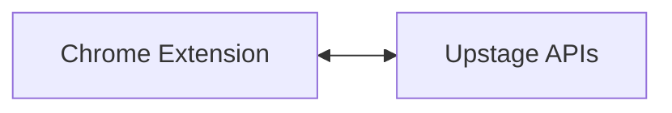

Canonical persistent state는 IndexedDB에 저장합니다.

| 저장소            | 설명                   |
| ----------------- | ---------------------- |
| `cases`           | 사용자가 시작한 Case   |
| `documents`       | Case에 속한 문서       |
| `parse elements`  | 문서 파싱 결과 element |
| `sources`         | Source ID와 근거       |
| `extracts`        | 역할별 추출 정보       |
| `guidance`        | Initial Guidance       |
| `quick questions` | Quick Question 정의    |
| `answers`         | 사용자 응답            |
| `chunks`          | Section chunk          |
| `conflicts`       | 충돌 정보              |
| `action items`    | 다음 행동              |

UI의 임시 상태만 Zustand로 관리합니다.

Extension의 서로 다른 JavaScript context 사이 통신에는 `@webext-core/messaging`을 사용합니다.

---

# Cache

Agent 분석 결과를 무조건 다시 처리하지 않습니다.

기본 cache identity:

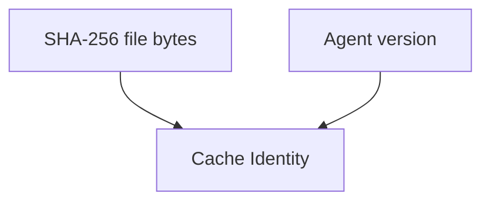

동일 문서와 동일 Agent version이면 가능한 범위에서 기존 Context를 재사용합니다.

이 구조는 향후:

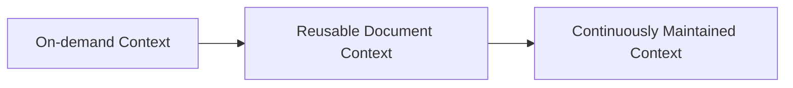

로 확장할 수 있게 설계되어 있습니다.

---

# Tech Stack

| 영역                | 기술                           |
| ------------------- | ------------------------------ |
| Extension           | WXT + Manifest V3              |
| Language            | TypeScript strict              |
| UI                  | React                          |
| Styling             | Tailwind CSS 4                 |
| UI primitives       | shadcn/ui, 필요한 것만         |
| Validation          | Zod                            |
| Local DB            | Dexie / IndexedDB              |
| UI State            | Zustand                        |
| Extension Messaging | `@webext-core/messaging`       |
| HTTP                | Native Fetch + AbortController |
| Hash                | Web Crypto SHA-256             |
| HTML Sanitization   | DOMPurify                      |
| PDF                 | `pdfjs-dist`                   |
| HWP / HWPX          | `@rhwp/core`                   |
| XLSX                | SheetJS CE                     |
| Virtualization      | `@tanstack/react-virtual`      |
| Unit Test           | Vitest                         |
| Component Test      | React Testing Library          |
| E2E                 | Playwright                     |
| Accessibility Test  | `@axe-core/playwright`         |

---

# Security & Privacy Principles

up to stage는 문서 기반 제품이기 때문에 사용자 동의와 데이터 경계를 명확하게 둡니다.

| 원칙                          | 설명                                                     |
| ----------------------------- | -------------------------------------------------------- |
| 사용자 선택 전 문서 전송 금지 | 사용자가 선택한 문서만 외부로 전송                       |
| AI 처리 고지                  | 전송 전에 명확한 AI 처리 고지                            |
| 최소 권한                     | 기본 `<all_urls>` 권한 지양                              |
| browsing history 금지         | browsing history 수집 금지                               |
| cookies 미사용                | cookies 미사용                                           |
| API Key 보호                  | API Key 로그 금지                                        |
| 원문 보호                     | 원문 전체 console log 금지                               |
| prompt 최소화                 | Quick Question 답변을 필요 이상의 prompt에 포함하지 않음 |
| Source ID 격리                | Case 간 Source ID 혼입 차단                              |
| 근거 ID 검증                  | AI가 근거 ID를 임의 생성하지 못하게 validation           |

---

# Repository

```text
.
├── AGENTS.md
├── README.md
├── STRUCTURE.md
├── FILES.md
├── entrypoints/
├── src/
│   ├── core/
│   ├── features/
│   ├── renderers/
│   ├── components/
│   ├── models/
│   └── styles/
├── docs/
├── references/
├── test/
└── public/
```

이 저장소는 단순 소스코드만 담지 않습니다.

개발 에이전트가 구현 전에 필요한 근거를 스스로 조회할 수 있도록 다음을 함께 보관합니다.

### `docs/`

제품·아키텍처·데이터 계약·디자인·엔지니어링·보안·테스트·로드맵 문서.

### `references/upstage/`

- 확정 Studio Agent JSON
- 실제 Agent 실행 결과
- 이전 비교 실행 결과
- Upstage API / Studio 매뉴얼

### `references/design/`

- Figma 구현 대상 Node Map
- 주요 Layout 정보
- 구현 참고 자료

### `references/presentation/`

- JunctionX 발표 자료
- 발표자 노트

### `references/research/`

- Chrome Extension
- 접근성
- 보안
- Document AI 기술 검증 자료

---

# 개발 에이전트 사용 규칙

이 코드베이스는 AI Coding Agent가 문맥을 추측하지 않고 필요한 자료를 찾아 구현하도록 설계되어 있습니다.

작업 전 기본 순서:

```text
1. 루트 AGENTS.md 읽기
2. 작업 대상에서 가장 가까운 하위 AGENTS.md 읽기
3. docs/00-index.md 확인
4. 필요한 Source of Truth만 조회
5. 구현
6. 테스트
7. 기능 단위 커밋
```

Upstage 관련 구현은 `references/upstage/`의 실제 문서와 실행 결과를 코드보다 먼저 확인합니다.

Figma 기반 UI는 `references/design/`의 Node Map을 확인하고, Figma Tool에 접근할 수 있다면 원본 node의 Design Context를 다시 조회합니다.

---

# Git Workflow

눈에 띄는 기능 하나가 동작할 때마다 즉시 커밋합니다.

형식:

```text
feat: 현재 페이지의 관련 문서를 발견

- PDF, HWP, HWPX, XLSX 후보를 현재 DOM에서 수집
- URL과 파일명을 기준으로 중복 후보를 제거
- 사용자가 선택하기 전에는 외부 API로 문서를 전송하지 않도록 분리
- 주요 attachment discovery 케이스를 테스트
```

한 Phase 전체를 하나의 거대한 커밋으로 만들지 않습니다.

자세한 개발 순서는 `docs/08-roadmap/`과 각 폴더의 `AGENTS.md`를 따릅니다.

---

# Development Phases

개발은 8개 Phase로 나뉩니다.

| Phase   | 내용                           |
| ------- | ------------------------------ |
| Phase 1 | Extension Shell                |
| Phase 2 | Document Discovery & Selection |
| Phase 3 | Upstage Agent Integration      |
| Phase 4 | Guidance & Quick Check         |
| Phase 5 | Evidence & Source Registry     |
| Phase 6 | Document Viewer                |
| Phase 7 | Retrieval & Solar Q&A          |
| Phase 8 | Accessible Semantic View       |

이 순서는 단순 일정 구분이 아니라 subsystem 의존성을 반영합니다.

---

# Current Status

현재 프로젝트에서 확정된 것:

| 항목                          | 상태 |
| ----------------------------- | ---- |
| Product direction             | 확정 |
| Chrome Extension architecture | 확정 |
| Upstage Studio Agent v0.22    | 확정 |
| Agent 실제 실행 검증          | 완료 |
| Agent role taxonomy           | 확정 |
| Source/Evidence architecture  | 확정 |
| Side Panel 주요 Flow          | 확정 |
| Viewer 3-column architecture  | 확정 |
| P0 기술 스택                  | 확정 |
| Development Phase             | 확정 |

이 저장소의 초기 scaffold에는 의도적으로 완성된 제품 코드를 넣지 않습니다.

기획·기술 계약과 Agent/Reference를 Source of Truth로 사용하면서 Phase 단위로 구현합니다.

---

# Team

## GOODMORNING

**JunctionX Korea 2026**에서 up to stage를 제작하는 팀입니다.

- Min Hyeok Lee
- Sung hyun Kim
- Si Won Lee

프로젝트는 Apple Developer Academy @ POSTECH에서 만난 팀원들의 문제의식과, JunctionX Korea 2026 Upstage Track에서 제공하는 Document Intelligence 기술을 바탕으로 시작되었습니다.

---

# Vision

오늘은 사용자가 up to stage를 현재 사이트로 가져옵니다.

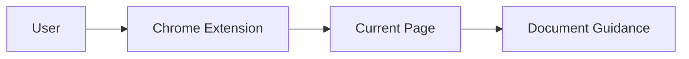

향후에는 학교·재단·공공기관이 자신의 문서를 누구에게나 접근 가능한 Guidance로 제공할 수 있습니다.

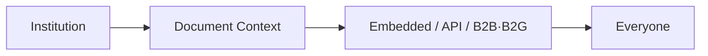

기회는 이미 존재할 수 있습니다.

하지만 발견하고, 이해하고, 검증하고, 행동할 수 있어야 실제 기회가 됩니다.

> **Opportunity for Everyone.**

---

## Project Principle

| 가치           | 의미                      |
| -------------- | ------------------------- |
| **Structured** | Understand the structure. |
| **Trusted**    | Return to the evidence.   |
| **Accessible** | Navigate it your way.     |

> Intelligence should not hide the document.  
> **It should unfold it.**
