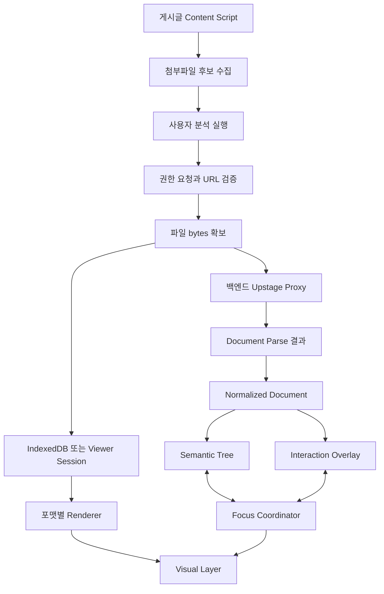

# Unfold 범용 접근성 문서 뷰어 기술 설계 및 검증 문서

- 작성 기준일: 2026-08-22
- 대상 제품: Chrome Extension 기반 Document Agent, Unfold
- 핵심 목표: 웹 게시글에 연결된 문서를 탭으로 일일이 열지 않고 확보하고, Upstage Document AI로 구조를 분석한 뒤, 확장 프로그램 내부의 오픈소스 뷰어 위에 시각적 오버레이와 스크린리더용 접근성 트리를 제공한다.
- 주요 대상 포맷: PDF, DOCX, XLSX, PPTX, HWP, HWPX, JPEG, PNG, BMP, TIFF, HEIC
- 문서 성격: 지금까지 논의한 구현 가능성, 제약, 오픈소스 선택, 라이선스, 접근성 구조, 예외 처리, MVP 설계를 하나의 기술 문서로 재구성한 결과물이다.

---

## 1. 제품에서 해결하려는 문제

대학, 공공기관, 장학재단, 학교 포털의 공고는 본문만 읽어서는 충분하지 않은 경우가 많다. 실제 신청 조건, 제출 양식, 예외 규정, 평가 기준, 개인정보 수집 동의서가 PDF, HWP, HWPX, DOCX, XLSX, PPTX 같은 첨부문서로 분리되어 있다.

기존 사용 흐름은 다음과 같다.

```text
게시글 진입
  -> 첨부파일 목록 확인
  -> 파일을 하나씩 다운로드하거나 새 탭으로 열기
  -> 서로 다른 뷰어에서 문서 읽기
  -> 지원 자격, 기한, 제출 서류를 직접 비교
  -> 필요하면 문서별로 다시 검색
```

Unfold가 목표로 하는 흐름은 다음과 같다.

```text
게시글 진입
  -> 확장 프로그램 명시적 실행
  -> 첨부파일 자동 탐지
  -> 사용자가 분석할 파일 확인
  -> 파일을 다운로드 폴더에 저장하지 않고 메모리로 가져오기
  -> Upstage Document Parse로 구조, 텍스트, 표, 차트, 좌표 분석
  -> 포맷별 오픈소스 뷰어로 원본 시각 표현 렌더링
  -> 공통 접근성 모델 생성
  -> 스크린리더용 Semantic DOM과 좌표 오버레이 생성
  -> 제목, 목록, 표, 그림 단위 탐색과 원문 위치 이동 제공
```

제품의 핵심은 단순한 OCR이 아니다. **시각적으로만 암시되어 있던 문서 구조를 명시적인 접근성 구조로 복원하고, 복원된 구조와 원본의 위치를 연결하는 것**이다.

---

## 2. 기술적으로 가능한 범위

### 2.1 게시글에 첨부된 파일 탐지

일반적인 웹페이지의 첨부파일은 Content Script가 DOM에서 탐지할 수 있다.

주요 탐지 대상은 다음과 같다.

- `<a href="...">` 링크
- `download` 속성이 있는 링크
- 파일 확장자가 URL 또는 텍스트에 노출된 링크
- 다운로드 버튼
- `onclick` 또는 JavaScript 라우팅으로 동작하는 요소
- iframe, embed, object에 포함된 문서
- SPA 전환 후 동적으로 추가된 첨부파일
- 게시글 메타데이터나 JSON에 포함된 파일 URL

가장 단순한 탐지 예시는 다음과 같다.

```ts
const EXTENSIONS = [
  'pdf', 'docx', 'xlsx', 'pptx', 'hwp', 'hwpx',
  'jpg', 'jpeg', 'png', 'bmp', 'tif', 'tiff', 'heic'
];

function looksLikeAttachment(url: string, text: string): boolean {
  const normalized = `${url} ${text}`.toLowerCase();
  return EXTENSIONS.some((ext) => normalized.includes(`.${ext}`));
}

function discoverAttachments(): Array<{ url: string; label: string }> {
  return Array.from(document.querySelectorAll<HTMLAnchorElement>('a[href]'))
    .map((anchor) => ({
      url: new URL(anchor.href, location.href).href,
      label: anchor.textContent?.trim() || anchor.download || anchor.href,
    }))
    .filter((item) => looksLikeAttachment(item.url, item.label));
}
```

실제 학교 사이트에서는 확장자가 URL에 없는 경우가 많다. 예를 들어 다음 형태다.

```text
/download.do?fileId=18752
/board/fileDownload?atchFileId=ABC&fileSn=2
/api/files/9c4fb6f4
```

따라서 실서비스에서는 다음 신호를 함께 사용해야 한다.

- 링크 텍스트에 표시된 파일명
- `title`, `aria-label`, `data-*` 속성
- 버튼 주변의 파일 아이콘과 확장자 텍스트
- HEAD 또는 GET 응답의 `Content-Type`
- `Content-Disposition` 헤더의 filename
- 사이트별 HTML 패턴
- 클릭 시 발생하는 네트워크 요청 규칙

SPA 사이트에는 `MutationObserver`가 필요하다.

```ts
const observer = new MutationObserver(() => {
  const attachments = discoverAttachments();
  chrome.runtime.sendMessage({
    type: 'ATTACHMENTS_DISCOVERED',
    attachments,
  });
});

observer.observe(document.documentElement, {
  subtree: true,
  childList: true,
});
```

### 2.2 첨부파일을 모두 새 탭에 여는 것

기술적으로 가능하다.

```ts
for (const file of attachments) {
  await chrome.tabs.create({
    url: file.url,
    active: false,
  });
}
```

그러나 제품 UX와 자원 사용 측면에서는 기본 전략으로 권하지 않는다.

문제점은 다음과 같다.

- 첨부파일이 많으면 탭이 한꺼번에 증가한다.
- DOCX, XLSX, PPTX, HWP는 Chrome이 직접 렌더링하지 않고 다운로드할 수 있다.
- 분석을 위해 탭을 열 필요가 없다.
- 사용자 세션과 브라우저 상태를 불필요하게 변경한다.
- 팝업성 동작으로 인식되어 사용자가 불편하게 느낄 수 있다.

따라서 탭 열기는 다음 상황에만 보조 기능으로 두는 것이 좋다.

- 사용자가 원문 탭 열기를 명시적으로 선택한 경우
- 접근성 뷰어와 원문을 비교해야 하는 경우
- 인증 방식 때문에 원래 탐색 컨텍스트가 꼭 필요한 경우

### 2.3 탭을 열지 않고 파일 바이트 확보

가능하다. 확장 프로그램의 Service Worker 또는 확장 프로그램 소유 페이지에서 `fetch()`로 파일을 받아 `ArrayBuffer` 또는 `Blob`으로 처리할 수 있다.

```ts
async function fetchAttachment(url: string): Promise<ArrayBuffer> {
  const response = await fetch(url, {
    method: 'GET',
    credentials: 'include',
    redirect: 'follow',
  });

  if (!response.ok) {
    throw new Error(`파일 요청 실패: HTTP ${response.status}`);
  }

  return response.arrayBuffer();
}
```

이 경우 사용자의 다운로드 폴더에는 파일이 저장되지 않는다.

```text
첨부 URL
  -> 확장 프로그램 fetch
  -> ArrayBuffer
  -> Blob 또는 Uint8Array
  -> 뷰어 렌더링
  -> Upstage API 업로드
```

`chrome.downloads` 권한도 기본적으로 필요하지 않다. 파일을 사용자 저장소에 실제로 저장하거나 다운로드 기록을 관리할 때만 필요하다.

### 2.4 현재 탭이 아닌 다른 탭의 PDF 접근

다른 탭에 열린 PDF의 존재와 URL을 찾는 것은 가능하지만, 권한 조건을 구분해야 한다.

- `chrome.tabs.query()`로 탭 목록 조회 가능
- URL, 제목 같은 민감한 탭 속성은 `tabs` 권한, 호스트 권한, 또는 해당 탭에 부여된 `activeTab` 권한이 필요할 수 있음
- `activeTab`은 사용자 동작으로 활성화된 **현재 활성 탭**에 대한 임시 접근 권한
- 이미 백그라운드에 있는 임의의 다른 탭 전체에 `activeTab`이 자동 적용되는 것은 아님
- 다른 탭의 파일 URL을 알고 있고 해당 호스트 권한이 있다면, 확장 프로그램 컨텍스트에서 다시 fetch하는 방식이 현실적

따라서 제품 동작은 다음 두 가지로 나누는 것이 좋다.

#### 현재 탭에서 실행

사용자가 게시글 또는 PDF 탭에서 확장 버튼이나 단축키를 누른다.

```text
사용자 제스처
  -> activeTab 임시 권한
  -> 현재 탭 URL과 DOM 확인
  -> 첨부파일 탐지 또는 PDF URL 확보
```

#### 백그라운드 다른 탭 찾기

사용자가 명시적으로 "열린 문서 찾기"를 선택하고, 필요한 탭 권한을 바탕으로 후보를 보여준다. 이 기능은 최소 권한 원칙과 스토어 심사를 고려해 MVP에서는 후순위로 두는 것이 안전하다.

---

## 3. Chrome 권한 모델

### 3.1 `activeTab`

`activeTab`은 사용자가 확장 아이콘을 누르거나, 명령 단축키를 실행하거나, 컨텍스트 메뉴를 선택한 경우 현재 활성 탭에 임시 접근을 부여한다.

가능한 작업은 다음과 같다.

- 현재 탭 URL과 제목 확인
- `scripting` 권한과 함께 Content Script 실행
- 현재 페이지 DOM 탐색
- 해당 탭의 주 프레임 origin에 대한 임시 호스트 접근

권한은 사용자가 다른 origin으로 이동하거나 탭을 닫으면 해제된다.

이 제품에 적합한 이유는 다음과 같다.

- 모든 사이트에 대한 영구 권한을 설치 시점에 요구하지 않아도 된다.
- 사용자가 분석을 시작한 페이지에만 권한을 부여할 수 있다.
- Chrome Web Store의 최소 권한 설명이 단순해진다.

한계는 다음과 같다.

- 게시글에 들어오기만 했다고 자동으로 활성화되지 않는다.
- 임의의 백그라운드 탭에 자동 적용되지 않는다.
- 지속적 자동 감시 제품에는 부족하다.

### 3.2 `scripting`

Content Script를 동적으로 주입하려면 필요하다.

```json
{
  "permissions": ["activeTab", "scripting"]
}
```

게시글의 링크를 탐색하고 MutationObserver를 설치하는 정도라면 충분하다. 다만 Chrome 내부 페이지, Chrome Web Store, 일부 제한 페이지에는 스크립트를 삽입할 수 없다.

### 3.3 `host_permissions`

확장 프로그램의 Service Worker나 확장 페이지가 외부 origin에서 파일을 fetch하려면 해당 호스트에 대한 권한이 필요하다.

```json
{
  "host_permissions": [
    "https://university.example.ac.kr/*"
  ]
}
```

모든 웹사이트를 지원하기 위해 `https://*/*`를 설치 시 필수 권한으로 넣는 것은 기능상 편하지만, 사용자 신뢰와 스토어 심사 측면에서 부담이 크다.

권장 방식은 `optional_host_permissions`다.

```json
{
  "optional_host_permissions": [
    "https://*/*",
    "http://*/*"
  ]
}
```

사용자가 특정 게시글에서 분석을 실행할 때 현재 origin에 대한 권한만 요청한다.

```ts
const originPattern = `${new URL(tabUrl).origin}/*`;

const granted = await chrome.permissions.request({
  origins: [originPattern],
});
```

### 3.4 Content Script fetch와 확장 프로그램 fetch의 차이

Content Script는 웹페이지 origin에서 동작하므로 일반 웹의 Same Origin Policy와 CORS 제약을 받는다. 호스트 권한이 있더라도 Content Script 자체의 임의 cross-origin fetch 경로로 설계하지 않는 것이 좋다.

권장 구조는 다음과 같다.

```text
Content Script
  -> 첨부 후보와 페이지 정보만 수집
  -> Service Worker 또는 Viewer Page에 메시지
  -> 확장 프로그램 origin에서 권한 검증 후 fetch
```

Service Worker가 Content Script가 준 임의 URL을 그대로 fetch하게 만들면 보안 취약점이 될 수 있다. 다음 검증이 필요하다.

- `http:` 또는 `https:`만 허용
- 현재 탭 origin 또는 사용자 승인 origin인지 확인
- `javascript:`, `data:`, `chrome:`, `file:` 등의 위험하거나 불필요한 scheme 차단
- 사설 네트워크와 로컬호스트 접근 정책 결정
- 리디렉션 후 최종 URL 검증
- 허용 MIME 타입과 파일 크기 검증

### 3.5 `file://` 로컬 파일

전통적인 확장 프로그램 접근에서는 사용자가 확장 관리 화면에서 **파일 URL에 대한 액세스 허용**을 켜야 하는 경우가 많다.

그러나 Chrome 151 이상에서 제공되는 `chrome.mimeHandler` 기반 문서 핸들러는 전체 프레임 문서를 다루는 경우 로컬 `file://` 문서도 별도의 수동 파일 URL 권한 없이 확장 뷰어로 전달할 수 있다고 공식 문서에 명시되어 있다.

따라서 로컬 PDF까지 제품 핵심 범위에 넣을 경우 두 경로를 고려한다.

1. 일반 확장 페이지 방식: 사용자가 파일 접근 권한을 켬
2. Chrome 151 이상 MIME Handler 방식: MIME 스트림을 확장 뷰어가 직접 수신

---

## 4. 인증된 첨부파일을 가져올 때의 예외

같은 브라우저 세션에서 로그인한 학교 포털의 첨부파일은 `credentials: 'include'`로 쿠키가 함께 전송되어 가져올 수 있는 경우가 많다. 그러나 모든 다운로드가 단순 GET URL은 아니다.

### 4.1 단순 GET과 쿠키 인증

가장 쉬운 경우다.

```ts
fetch(fileUrl, {
  credentials: 'include',
});
```

확인해야 할 항목은 다음과 같다.

- 요청 URL의 origin
- 쿠키의 SameSite 설정
- 리디렉션되는 최종 origin
- 서버 CORS 정책
- 호스트 권한

### 4.2 POST 전용 다운로드

버튼을 누를 때 form POST를 전송하는 사이트가 있다.

```html
<form method="post" action="/download">
  <input name="fileId" value="1234">
</form>
```

URL만 추출해 새 탭으로 열거나 GET fetch를 하면 실패한다. 다음 중 하나가 필요하다.

- form action과 hidden input을 분석해 동일한 POST 요청 재현
- 사용자의 버튼 클릭을 트리거한 뒤 응답을 적절한 방식으로 확보
- 사이트별 어댑터 구현
- 전체 프레임 문서라면 Chrome MIME Handler 사용 검토

### 4.3 CSRF 토큰

요청에 hidden input, custom header, meta 태그 기반 CSRF 토큰이 필요한 경우가 있다.

이때 Content Script가 해당 토큰을 읽고, 확장 프로그램이 허용된 요청 형식으로 재구성할 수 있다. 토큰과 쿠키는 민감 정보이므로 로그와 장기 저장에서 제외해야 한다.

### 4.4 단일 사용 URL과 서명 URL

클릭 직전에 생성되는 signed URL은 다시 fetch할 때 만료되거나 이미 소비될 수 있다.

Chrome 151 이상의 `chrome.mimeHandler`는 Chrome이 이미 받은 응답 스트림을 확장 뷰어에 전달하므로, 단일 사용 URL과 POST 응답 문서에 유리하다.

### 4.5 `blob:` URL

웹페이지 JavaScript가 파일을 받아 `blob:` URL을 생성한 경우, 확장 Service Worker가 그 문자열만 받아 직접 fetch하기 어렵거나 origin 수명에 종속될 수 있다.

가능한 처리 방식은 다음과 같다.

- 페이지 컨텍스트에서 Blob을 읽고 ArrayBuffer로 전달
- 원래 네트워크 요청을 찾아 직접 재현
- 다운로드 버튼의 생성 로직에 사이트별 어댑터 적용

대용량 ArrayBuffer를 `chrome.runtime.sendMessage`로 한 번에 직렬화하는 것은 비효율적일 수 있다. Viewer Page에서 직접 fetch하거나, IndexedDB에 Blob을 저장하고 키만 전달하는 구조가 더 안정적이다.

### 4.6 암호화 문서와 비밀번호 문서

PDF, DOCX, XLSX, PPTX, HWPX가 암호화되었을 수 있다.

제품은 다음 상태를 구분해야 한다.

```text
UNSUPPORTED_ENCRYPTION
PASSWORD_REQUIRED
INVALID_PASSWORD
CORRUPTED_FILE
UNSUPPORTED_FORMAT
PARSE_FAILED
```

비밀번호를 입력받는 경우 다음 원칙이 필요하다.

- 메모리에만 보관
- 분석 API 전송 여부를 사용자에게 명시
- 로그와 분석 이벤트에서 비밀번호 제외
- 문서 처리 후 즉시 폐기

---

## 5. Chrome 기본 PDF Viewer 위에 직접 레이어를 올리는 문제

### 5.1 기존 판단

Chrome 기본 PDF Viewer는 일반 웹페이지 DOM처럼 안정적으로 확장할 수 있는 표면이 아니다. Chrome 내부의 PDF Viewer 구현, shadow DOM, 내부 확장 구조에 의존해 Content Script를 삽입하는 방식은 다음 문제가 있다.

- Chrome 업데이트에 따라 DOM 구조가 변할 수 있음
- 내부 페이지와 확장 페이지의 보안 경계
- 공식적으로 보장된 통합 API가 아님
- Chrome Web Store 검토와 브라우저별 호환성 문제
- iframe 또는 embed 상황에서 제약 증가

따라서 **Chrome 기본 PDF Viewer의 내부 DOM을 해킹하는 방식은 제품 핵심 구조로 사용하지 않는다.**

이 표현은 "무조건 불가능"이라는 뜻이 아니다. 일부 버전에서 제한적인 주입이나 탐색이 우연히 가능할 수 있지만, 안정적이고 공식적으로 지원되는 제품 기반으로 보기 어렵다는 뜻이다.

### 5.2 커스텀 Viewer Page 방식

PDF 링크를 확장 프로그램 소유 Viewer Page로 열고 PDF.js로 렌더링한다.

```text
chrome-extension://<extension-id>/viewer.html?source=<encoded-url>
```

장점은 다음과 같다.

- DOM과 레이아웃을 전부 제어 가능
- 오버레이, Semantic DOM, 단축키, 포커스 관리 구현 가능
- PDF.js의 Canvas, Text Layer, Annotation Layer 활용 가능
- Upstage 좌표와 화면 좌표를 직접 동기화 가능

단점은 다음과 같다.

- 원본 URL이 주소창에서 확장 URL로 바뀜
- 원본을 다시 fetch해야 함
- POST 전용 또는 단일 사용 URL 처리 어려움
- iframe 문서 가로채기가 복잡함

### 5.3 Chrome 151 이상 `chrome.mimeHandler`

Chrome은 2026년에 `chrome.mimeHandler` API를 공식 제공하기 시작했다. 공식 문서 기준 가용 버전은 Chrome 151 이상이다.

Manifest에 MIME Handler를 등록하면 전체 프레임의 특정 MIME 타입을 확장 프로그램 뷰어가 처리할 수 있다.

```json
{
  "mime_types_handler": {
    "application/pdf": {
      "handler_url": "viewer.html",
      "can_embed": true
    }
  }
}
```

기존 리디렉션 방식보다 유리한 점은 다음과 같다.

- 원본 URL이 주소창에 유지됨
- Chrome이 이미 받은 응답을 전달하므로 재요청 불필요
- POST 응답 문서와 단일 사용 URL 처리 가능
- `<embed>`, `<object>`, `<iframe>`의 전체 프레임 문서 처리 가능
- 로컬 `file://` 문서도 수동 파일 접근 토글 없이 처리 가능

주의사항은 다음과 같다.

- Chrome 151 이상이 필요함
- Chrome Web Store와 배포 대상 브라우저의 실제 지원 상태 검증 필요
- PDF 외 MIME 타입을 모두 등록할 수 있는지, 각 타입이 서버에서 정확한 `Content-Type`으로 전달되는지 확인 필요
- inline 이미지 같은 하위 리소스에는 적용되지 않음
- Firefox, Edge, Safari 확장과 동일한 API라고 가정하면 안 됨

해커톤 환경의 Chrome 버전이 충분히 최신이라면 PDF 사용자 경험은 MIME Handler 방식이 가장 강력하다. 호환성을 넓게 잡아야 한다면 기존 Viewer Page 방식을 fallback으로 유지한다.

---

## 6. 커스텀 뷰어를 사용하면 가능한 기능

확장 프로그램 내부에 오픈소스 뷰어를 내장하면 렌더링 표면을 직접 제어할 수 있다.

페이지 구조는 다음처럼 설계할 수 있다.

```html
<div class="document-page" data-page="1">
  <div class="visual-layer"></div>
  <div class="interaction-overlay" aria-hidden="true"></div>
</div>

<nav class="semantic-document" aria-label="문서 구조">
  <!-- Upstage 결과에서 생성한 접근성 DOM -->
</nav>
```

역할을 분리한다.

### Visual Layer

- PDF.js Canvas 또는 Text Layer
- OOXML Canvas 렌더러
- rhwp Canvas 또는 SVG 렌더러
- 이미지 `` 또는 Canvas

### Interaction Overlay

- Upstage bbox에 맞춰 배치한 투명 또는 반투명 요소
- 마우스 hover와 클릭
- 선택 영역 표시
- 원문 위치 하이라이트
- 평상시 `pointer-events: none`
- 접근성 탐색 모드에서만 `pointer-events: auto`

### Semantic Document

- 스크린리더가 읽는 실제 HTML 구조
- 제목, 문단, 목록, 표, 그림, 링크, 폼 컨트롤
- 시각적 overlay와 중복 낭독되지 않도록 설계
- 읽기 순서와 heading level을 보정

---

## 7. 단축키와 클릭 모드

### 7.1 특정 키를 누를 때만 클릭 가능한 레이어

기술적으로 가능하다.

```css
.interaction-overlay {
  position: absolute;
  inset: 0;
  pointer-events: none;
}

.document-viewer[data-inspection-mode="true"] .interaction-overlay {
  pointer-events: auto;
}
```

```ts
let inspectionMode = false;

function setInspectionMode(enabled: boolean) {
  inspectionMode = enabled;
  document
    .querySelector('.document-viewer')
    ?.setAttribute('data-inspection-mode', String(enabled));
}
```

### 7.2 modifier key를 누른 동안만 활성화

Option, Alt, Control 같은 modifier를 누른 동안만 활성화하는 것도 가능하다.

```ts
window.addEventListener('keydown', (event) => {
  if (event.altKey) {
    setInspectionMode(true);
  }
});

window.addEventListener('keyup', (event) => {
  if (!event.altKey) {
    setInspectionMode(false);
  }
});

window.addEventListener('blur', () => {
  setInspectionMode(false);
});
```

하지만 이것을 유일한 접근 방식으로 사용하면 안 된다.

이유는 다음과 같다.

- macOS와 Windows에서 modifier 동작이 다름
- 브라우저 메뉴와 운영체제 단축키가 먼저 소비할 수 있음
- VoiceOver와 NVDA가 일부 키 조합을 사용함
- 운동 장애 사용자가 키를 계속 누른 상태로 클릭하기 어려울 수 있음
- 키보드 전용 사용자는 포인터 동작을 수행하지 않을 수 있음

권장 방식은 **토글 단축키 + 선택적 modifier 클릭**이다.

```text
Alt+Shift+A 또는 사용자 지정 단축키
  -> 접근성 탐색 모드 켜기

Escape
  -> 접근성 탐색 모드 끄기

선택적 Option+Click
  -> 일시적으로 특정 bbox 요소 검사
```

Chrome `commands` API의 단축키 실행은 `activeTab`을 활성화하는 사용자 제스처로 인정된다.

### 7.3 모드 상태를 명확히 표현

접근성 모드가 켜졌는지 시각적, 음성적으로 알려야 한다.

```html
<div role="status" aria-live="polite" id="mode-status"></div>
```

```ts
status.textContent = enabled
  ? '접근성 탐색 모드가 켜졌습니다.'
  : '접근성 탐색 모드가 꺼졌습니다.';
```

---

## 8. Upstage Document Parse가 제공할 수 있는 정보

### 8.1 공식적으로 확인되는 구조화 기능

Upstage 공식 제품 페이지와 공식 블로그에서 다음이 확인된다.

- PDF, 스캔 이미지, 스프레드시트, 슬라이드 처리
- HTML과 Markdown 같은 구조화된 결과 출력
- 표와 차트 인식
- 요소 좌표 제공
- 문서 hierarchy 보존
- 섹션 간 관계 유지
- 복잡한 표와 여러 페이지에 걸친 표 처리
- 회전 문서와 긴 이미지 처리
- HWP와 HWPX 업로드 후 변환 처리

공식 예시에는 다음과 같은 Markdown heading 구조가 나타난다.

```md
# Auto Insurance Policy

## Article 1 (Coverage)

본문...
```

따라서 Upstage를 단순 OCR로만 보는 것은 맞지 않는다. 공식 설명상 Document Parse는 문서를 LLM이 읽을 수 있는 구조화된 HTML 또는 Markdown으로 변환하고, 문서 계층과 섹션 관계를 보존하는 것이 목적이다.

### 8.2 Upstage가 직접 제공하지 않는 것

Upstage 결과를 곧바로 완성된 WCAG 또는 ARIA 접근성 트리로 간주하면 안 된다.

Upstage가 제공하는 역할은 다음에 가깝다.

```text
원본 문서
  -> OCR
  -> Layout Analysis
  -> Element Classification
  -> Reading Order
  -> Table, Chart, Figure Recognition
  -> Structured HTML 또는 Markdown
  -> Element Coordinates
```

Unfold가 추가해야 하는 역할은 다음과 같다.

```text
Upstage 결과
  -> heading level 정규화
  -> parent-child 관계 정규화
  -> 반복 header/footer 제거 또는 별도 처리
  -> table header와 scope 지정
  -> figure와 caption 연결
  -> AI 생성 이미지 설명 표시
  -> 실제 링크와 버튼 복원
  -> Semantic HTML 생성
  -> 포커스와 화면 bbox 동기화
  -> VoiceOver, NVDA 테스트
```

### 8.3 heading 위계 분석에 대한 정확한 해석

공식 자료에는 `clean text hierarchy`, `document hierarchy`, `relationships between sections`가 명시되어 있으며, Markdown heading 예시도 있다. 따라서 **위계 분석을 수행한다고 볼 근거는 충분하다.**

다만 다음은 공식 자료만으로 단정할 수 없다.

- 모든 문서에서 H1, H2, H3가 완벽하게 정확하다는 보장
- heading level별 개별 정확도
- 내부 모델이 글자 크기, 굵기, 번호 체계를 각각 어떤 가중치로 사용하는지
- 모델 아키텍처의 상세 추론 방식

일반적인 Document AI가 활용하는 것으로 추정할 수 있는 신호는 다음과 같다.

- 글자 크기와 굵기
- 글꼴과 스타일
- 상하 여백
- 좌우 정렬
- 페이지 내 위치
- 들여쓰기
- `1.`, `1.1`, `가.`, `(1)` 같은 번호 체계
- 앞뒤 문단과의 관계
- 반복되는 머리말과 꼬리말
- 표, 상자, 다단과의 공간 관계
- 제목처럼 쓰이는 언어 표현

이 목록은 일반적인 문서 구조 분석 원리이며, Upstage 내부 구현을 공개한 내용은 아니다.

### 8.4 94.48% structure accuracy 해석

Upstage의 2025년 공식 비교 글에는 Document Parse에 대해 94.48% structure accuracy 수치가 제시되어 있다. 이 수치는 Upstage가 공개한 전체 구조 성능 지표로 이해해야 한다.

다음처럼 해석하면 안 된다.

```text
모든 heading level이 94.48% 정확하다
표 header가 94.48% 정확하다
모든 문서 유형에서 동일하다
외부 독립 평가에서 검증된 수치다
```

Unfold에서는 별도의 실제 문서 벤치마크로 heading hierarchy, table reconstruction, reading order, bbox alignment를 검증해야 한다.

### 8.5 Enhanced mode

2025년 12월 공개 당시 Enhanced mode는 다음을 대상으로 했다.

- 복잡한 표
- 차트
- 다이어그램
- 이미지
- 체크박스
- 시각 요소의 구조화된 표현
- 자연어 설명

공개 당시에는 beta와 nightly model 기반으로 안내되었다. 2026년 8월 실제 API의 stable model, 가격, mode 이름은 구현 직전에 최신 문서를 다시 확인해야 한다.

---

## 9. Upstage 지원 포맷 범위의 검증 상태

Upstage의 공식 제품 페이지는 개별 확장자 목록보다 범주를 중심으로 설명한다. 공식 GitHub 통합 프로젝트와 공식 업데이트 글을 함께 보면 다음 범위를 확인할 수 있다.

### 9.1 안정적으로 핵심 범위로 잡을 포맷

| 범주 | 확장자 | 근거 상태 | Unfold 뷰어 전략 |
|---|---|---|---|
| PDF | `.pdf` | 공식 제품과 여러 공식 통합 자료에서 일관되게 확인 | PDF.js |
| 이미지 | `.jpg`, `.jpeg`, `.png`, `.bmp`, `.tif`, `.tiff` | 공식 통합 자료에서 확인 | 브라우저 기본 이미지, TIFF adapter |
| Office Open XML | `.docx`, `.pptx`, `.xlsx` | 공식 통합 자료에서 확인 | `@silurus/ooxml` |
| 한글 | `.hwp`, `.hwpx` | 2025년 공식 업데이트에서 변환 지원 확인 | `@rhwp/core` |
| 이미지 | `.heic` | 일부 공식 통합 자료에서 확인 | 별도 codec 또는 서버 변환 |

### 9.2 공식 자료 간 목록 차이

일부 Upstage 공식 MCP 저장소에는 `parse_document`가 PDF, JPEG, PNG, TIFF, BMP, GIF, WEBP를 지원한다고 적혀 있고, 다른 공식 통합 자료에는 HEIC, DOCX, PPTX, XLSX가 포함되어 있다.

이 차이는 다음 원인일 수 있다.

- 저장소 버전 차이
- API endpoint 차이
- Document Parse와 OCR, Information Extract의 지원 범위 차이
- 클라이언트 wrapper의 제한
- 문서 업데이트 지연

따라서 제품 코드에 확장자 목록을 고정한 뒤 무조건 지원한다고 선언하기보다 서버 capability 또는 실제 샘플 호출로 검증해야 한다.

권장 상태 모델은 다음과 같다.

```ts
type FormatSupportStatus =
  | 'verified'
  | 'experimental'
  | 'conversion-required'
  | 'unsupported';
```

### 9.3 레거시 Office 포맷

현재 핵심 범위는 OOXML이다.

- 지원 대상으로 잡는 것: DOCX, XLSX, PPTX
- 별도 검증 없이 지원한다고 말하지 않을 것: DOC, XLS, PPT

레거시 바이너리 Office 포맷은 브라우저 전용 오픈소스 렌더링 난도가 크게 높아지며, 선택한 `@silurus/ooxml`의 핵심 범위도 아니다.

---

## 10. 최소 오픈소스로 최대 포맷을 커버하는 권장 구성

### 10.1 최종 권장 구성

**엄격한 오픈소스 기준과 라이브러리 수 최소화를 동시에 고려하면 다음 구성이 가장 균형이 좋다.**

| 역할 | 라이브러리 또는 브라우저 기능 | 포맷 | 라이선스 | 선택 이유 |
|---|---|---|---|---|
| PDF 렌더링 | PDF.js | PDF | Apache-2.0 | 검증된 표준 선택, Text Layer와 Annotation Layer 활용 가능 |
| Office OOXML 렌더링 | `@silurus/ooxml` | DOCX, XLSX, PPTX | MIT | 하나의 프로젝트로 3개 핵심 Office 포맷 처리 |
| 한글 렌더링 | `@rhwp/core` | HWP, HWPX, 일부 HML | MIT | Rust와 WASM 기반, 브라우저 렌더링, HWP와 HWPX 동시 지원 |
| 일반 이미지 | 브라우저 기본 ``와 Canvas | JPEG, PNG, BMP, GIF, WEBP | 브라우저 기능 | 추가 의존성 없음 |
| TIFF 선택 지원 | UTIF.js | TIFF | MIT | 브라우저 기본 지원이 약한 TIFF 보완 |
| HEIC 선택 지원 | 별도 검증한 codec 또는 백엔드 변환 | HEIC | 구현 선택에 따라 다름 | codec과 라이선스 검토가 필요함 |
| 접근성 트리와 Overlay | 직접 구현 | 모든 포맷 공통 | 자체 코드 | 별도 프레임워크가 필요하지 않음 |

핵심 오픈소스는 세 개다.

```text
1. PDF.js
2. @silurus/ooxml
3. @rhwp/core
```

TIFF가 해커톤 필수라면 UTIF.js를 네 번째로 추가한다. HEIC는 무리하게 브라우저 codec을 하나 더 넣기보다 서버에서 PNG 또는 JPEG로 변환하는 경로가 더 단순할 수 있다.

### 10.2 왜 PDF.js를 별도로 유지하는가

OOXML 범용 뷰어가 PDF도 함께 처리한다고 주장하는 프로젝트가 있어도 PDF.js를 제거하지 않는 이유는 다음과 같다.

- PDF가 가장 중요한 대표 포맷일 가능성이 높음
- PDF.js는 PDF 렌더링 생태계에서 성숙도가 높음
- 페이지 viewport, Text Layer, Annotation Layer를 활용 가능
- bbox 정렬과 텍스트 검색에 유리
- 해커톤 데모 당일 PDF 호환성 실패 위험을 낮춤

### 10.3 `@silurus/ooxml`

이 프로젝트는 브라우저에서 DOCX, XLSX, PPTX를 파싱해 Canvas 2D로 렌더링한다.

주요 특징은 다음과 같다.

- DOCX Viewer와 headless API
- XLSX Workbook, Sheet Viewer와 selection geometry
- PPTX Presentation Viewer
- Rust와 WASM parser
- Worker 기반 처리
- format별 entry point
- MIT 라이선스
- third-party 의존성은 MIT, Apache-2.0 또는 호환 가능한 permissive license로 안내
- 수식 엔진과 고급 차트 기능을 선택적으로 로드 가능

2026년 8월 공식 README에 제시된 format별 대략적인 reachable asset 크기는 다음과 같다.

| Import | Reachable assets | gzip 예상 |
|---|---:|---:|
| `@silurus/ooxml/docx` | 약 4.0 MB | 약 1.2 MB |
| `@silurus/ooxml/xlsx` | 약 2.6 MB | 약 0.82 MB |
| `@silurus/ooxml/pptx` | 약 2.5 MB | 약 0.78 MB |
| 선택적 math engine | 약 3.1 MB | 약 1.1 MB |

해커톤에서는 수식과 고급 차트를 반드시 보여주지 않는다면 optional module을 제외해 번들 크기를 줄인다.

주의점은 다음과 같다.

- Canvas 중심 출력이므로 접근성 DOM을 별도로 만들어야 함
- Microsoft Office와 동일한 fidelity를 보장하지 않음
- 복잡한 SmartArt, 고급 차트, 특수 글꼴, 매크로, legacy binary format은 별도 검증 필요
- 프로젝트 자체가 매우 활발하지만 비교적 신생이므로 실제 대학 문서 corpus로 POC 필요
- 공식 README에 AI coding agent 활용 비중이 높다고 명시되어 있으므로, 테스트와 코드 감사 없이 신뢰하지 않음

### 10.4 `@rhwp/core`

`rhwp`는 Rust와 WebAssembly 기반 HWP, HWPX 뷰어와 편집기 프로젝트다.

공식 저장소에서 확인되는 범위는 다음과 같다.

- HWP 5.0 parser
- HWPX parser
- 일부 HML 가져오기
- 문단, 표, 수식, 이미지, 차트 렌더링
- 다단과 표 행 분할을 포함한 pagination
- 머리말, 꼬리말, 바탕쪽, 각주
- Web 환경의 Canvas 또는 CanvasKit 렌더링
- CLI의 SVG, PNG, PDF export
- MIT 라이선스

우리는 Rust를 직접 개발하지 않고 npm package의 JavaScript wrapper와 prebuilt WASM을 사용하면 된다.

```ts
import init, { HwpDocument } from '@rhwp/core';

await init();

const bytes = new Uint8Array(arrayBuffer);
const document = new HwpDocument(bytes);
```

주의점은 다음과 같다.

- v1.0 이전의 발전 중인 엔진
- 복잡한 HWP 문서의 완전한 fidelity를 사전 보장할 수 없음
- 폰트가 다르면 줄바꿈과 pagination이 달라질 수 있음
- 배포 패키지의 폰트와 assets를 직접 검사해야 함
- 프로젝트 문서에는 저작권 보호 대상 한컴 또는 Microsoft 폰트를 번들하지 말라는 guardrail이 명시되어 있음
- 사용 버전을 고정하고 `LICENSE`, `THIRD_PARTY_LICENSES.md`, package asset을 감사해야 함

### 10.5 PDF.js

PDF.js는 Mozilla의 HTML5 기반 PDF 렌더러다.

이 제품에서 활용할 수 있는 요소는 다음과 같다.

- page rendering to Canvas
- viewport와 scale
- text content 추출
- Text Layer
- Annotation Layer
- 페이지 단위 virtualization
- 검색과 selection의 기반

PDF.js가 생성한 텍스트를 최종 접근성 구조로 그대로 사용하는 것은 충분하지 않을 수 있다. 읽기 순서, heading level, 표 구조, 그림 설명은 Upstage 결과와 Unfold 정규화 로직을 사용한다.

### 10.6 일반 이미지

JPEG, PNG, BMP, GIF, WEBP는 브라우저 기본 이미지 디코딩을 우선 사용한다.

```html

```

원본 ``는 시각 레이어이므로 `alt=""`와 `aria-hidden="true"`를 사용하고, 실제 설명은 Semantic Document의 `<figure>`에 둔다.

### 10.7 TIFF

Chrome의 TIFF 직접 렌더링은 일반적인 웹 호환 범위로 보기 어렵다. TIFF까지 브라우저 내부에서 보여주려면 UTIF.js 같은 decoder를 추가하는 방법이 있다.

```text
TIFF bytes
  -> UTIF.js decode
  -> RGBA
  -> Canvas
```

다중 페이지 TIFF를 지원하려면 각 IFD를 페이지로 취급해 Viewer Adapter에 연결해야 한다.

### 10.8 HEIC

HEIC는 브라우저 기본 지원과 codec licensing이 단순하지 않다. 공개 wrapper 하나만 보고 무조건 포함하면 안 된다.

선택지는 다음과 같다.

1. 유지보수와 라이선스를 검토한 libheif WASM wrapper 사용
2. 백엔드에서 HEIC를 PNG 또는 JPEG로 변환
3. 시각 뷰어는 실험 지원으로 두고, 원본은 Upstage로 직접 분석
4. 해커톤 핵심 범위에서 제외하고 지원 예정으로 표시

최소 오픈소스 원칙이라면 **HEIC 변환을 백엔드 어댑터로 분리**하는 방식이 가장 단순하다.

---

## 11. 검토했지만 기본 선택에서 제외한 오픈소스

### 11.1 docx-preview

- 대상: DOCX
- 출력: HTML에 가까운 구조
- 라이선스: Apache-2.0
- 장점: Canvas보다 Semantic DOM과 접근성 보정이 쉬움
- 단점: DOCX만 처리하므로 라이브러리 수가 증가

Office 문서 중 DOCX 접근성 품질을 가장 중요하게 다루는 Phase 2에서는 `@silurus/ooxml/docx` 대신 또는 함께 비교할 가치가 있다.

### 11.2 pptx-renderer

- 대상: PPTX
- 출력: HTML과 SVG 중심
- 본체 라이선스: Apache-2.0
- 일부 third-party 파일: MPL-2.0 고지 존재
- 장점: SVG 기반 hit testing과 overlay에 유리할 수 있음
- 단점: PPTX 전용 의존성이 하나 더 늘어남

PPTX 데모에서 객체 단위 선택과 SVG가 필수일 때 대안으로 검증한다.

### 11.3 ShrimpDocViewer

범용 문서 뷰어를 표방하고 다양한 포맷을 한 API로 처리할 수 있다는 장점이 있지만, 검토 시점에 매우 신생이고 규모가 작았다. 해커톤 핵심 렌더러를 맡기기에는 다음 위험이 있다.

- 낮은 프로젝트 성숙도
- 실제 문서 corpus 검증 부족
- 원격 asset 또는 PDFium 관련 빌드 구성 확인 필요
- Manifest V3에서 remote hosted code 또는 remote WASM 문제가 생길 수 있음

따라서 핵심 경로가 아니라 실험 후보로 둔다.

### 11.4 DocMentis UDoc Viewer

wrapper가 오픈소스로 보여도 핵심 WASM이 비공개 또는 custom runtime license이면 엄격한 오픈소스 구성으로 볼 수 없다. attribution, telemetry, 상용 라이선스 조건이 개입될 수 있으므로 이 프로젝트의 **strict open-source 최소 구성**에서는 제외한다.

### 11.5 LibreOffice WASM 또는 서버 변환

LibreOffice를 WASM 또는 서버에서 사용하면 Office와 OpenDocument 포맷을 넓게 변환할 수 있지만, 다음 비용이 있다.

- 매우 큰 번들 또는 서버 런타임
- 초기 로딩과 메모리 비용
- 확장 프로그램 패키징 난도
- 라이선스와 배포 방식 검토
- 해커톤 MVP의 복잡도 증가

브라우저 내 최소 구성보다는 서버 변환 제품으로 확장할 때 검토한다.

---

## 12. 해커톤과 상용화 관점의 라이선스

### 12.1 핵심 라이선스 표

| 구성 요소 | 라이선스 | 해커톤 사용 | 수정 | 상용 배포 | 필수 조치 |
|---|---|---:|---:|---:|---|
| PDF.js | Apache-2.0 | 가능 | 가능 | 가능 | LICENSE와 NOTICE 유지 |
| `@silurus/ooxml` | MIT | 가능 | 가능 | 가능 | 저작권과 라이선스 고지 유지, third-party notices 포함 |
| `@rhwp/core` | MIT | 가능 | 가능 | 가능 | 저작권과 라이선스 고지 유지, third-party licenses 포함 |
| UTIF.js | MIT | 가능 | 가능 | 가능 | 저작권과 라이선스 고지 유지 |
| docx-preview | Apache-2.0 | 가능 | 가능 | 가능 | LICENSE와 NOTICE 유지 |
| pptx-renderer | Apache-2.0 | 가능 | 가능 | 가능 | LICENSE와 third-party notices 유지, MPL 파일 수정 시 조건 검토 |

이 조합은 대체로 permissive license 중심이므로 해커톤 사용과 향후 상용화에 적합하다.

### 12.2 배포 저장소 구조

```text
extension/
  LICENSE
  THIRD_PARTY_NOTICES.md
  licenses/
    pdfjs-Apache-2.0.txt
    silurus-ooxml-MIT.txt
    silurus-ooxml-THIRD_PARTY_NOTICES.md
    rhwp-MIT.txt
    rhwp-THIRD_PARTY_LICENSES.md
    utifjs-MIT.txt
```

### 12.3 폰트 라이선스

문서 뷰어는 코드 라이선스보다 폰트 문제가 더 위험할 수 있다.

금지할 것:

- 한컴 번들 폰트 복사
- Microsoft Office 전용 폰트 재배포
- 시스템에서 추출한 상용 폰트를 확장 zip에 포함
- 라이선스가 불명확한 웹 폰트 포함

권장할 것:

- 시스템 폰트를 사용하되 fallback 차이를 허용
- Noto Sans KR, Noto Serif KR 같이 배포 조건이 명확한 폰트 사용
- 폰트가 없을 때 대체되었음을 진단 로그에 표시
- bbox는 Upstage normalized coordinate 기준으로 맞추고, 텍스트 줄바꿈 차이를 감안

### 12.4 릴리스 전 감사

다음 검사는 필수다.

- npm lockfile 기준 transitive dependency license 확인
- 빌드 산출물에 remote script URL이 없는지 확인
- WASM이 확장 패키지 내부에서 로드되는지 확인
- 폰트 파일 목록과 라이선스 확인
- Source Map에 비밀키가 없는지 확인
- `THIRD_PARTY_NOTICES.md` 생성과 검토
- 사용하는 버전을 package lock으로 고정

---

## 13. JavaScript와 TypeScript만으로 개발 가능한가

가능하다. 제품 코드 전체를 TypeScript, HTML, CSS로 작성할 수 있다.

```text
Unfold Chrome Extension
  |- TypeScript
  |- HTML
  |- CSS
  |- PDF.js JavaScript bundle
  |- @silurus/ooxml JavaScript wrapper + WASM
  |- @rhwp/core JavaScript wrapper + WASM
  |- 선택적 UTIF.js
```

Rust toolchain이 필요한 경우는 다음뿐이다.

- rhwp 또는 OOXML parser 자체를 수정하는 경우
- 새로운 WASM 기능을 upstream에 추가하는 경우
- 직접 빌드한 WASM 배포가 필요한 경우

npm에 배포된 prebuilt package를 사용하면 일반적인 Vite 또는 Rollup 프로젝트로 처리할 수 있다.

### Manifest V3 주의

Manifest V3는 원격 실행 코드를 허용하지 않는다. JavaScript와 WASM은 확장 프로그램 패키지 안에 포함해야 한다.

금지 예시:

```html
<script src="https://cdn.example.com/pdf.js"></script>
```

권장 예시:

```ts
import * as pdfjsLib from 'pdfjs-dist';
```

WASM을 사용하려면 Extension Page의 CSP가 다음 최소 정책을 포함할 수 있다.

```json
{
  "content_security_policy": {
    "extension_pages": "script-src 'self' 'wasm-unsafe-eval'; object-src 'self'"
  }
}
```

remote WASM을 런타임에 받아 실행하는 것도 Chrome Web Store의 remote hosted code 위반이 될 수 있으므로 패키지 내부 asset으로 복사해야 한다.

---

## 14. 권장 코드베이스 구조

```text
src/
  manifest.json

  background/
    service-worker.ts
    permission-manager.ts
    attachment-fetcher.ts
    upload-client.ts
    job-store.ts

  content/
    attachment-detector.ts
    site-adapters/
      generic.ts
      university-a.ts
      university-b.ts

  viewer/
    viewer.html
    viewer.ts
    viewer-state.ts
    document-session.ts

    renderers/
      renderer.ts
      pdf-renderer.ts
      ooxml-docx-renderer.ts
      ooxml-xlsx-renderer.ts
      ooxml-pptx-renderer.ts
      hwp-renderer.ts
      image-renderer.ts
      tiff-renderer.ts
      heic-renderer.ts

    accessibility/
      normalized-document.ts
      upstage-adapter.ts
      hierarchy-normalizer.ts
      semantic-tree-builder.ts
      overlay-builder.ts
      focus-coordinator.ts
      keyboard-controller.ts
      announcement-manager.ts

    components/
      toolbar.ts
      document-outline.ts
      source-panel.ts
      parse-status.ts

  shared/
    messages.ts
    mime.ts
    errors.ts
    limits.ts
    url-policy.ts

  backend-client/
    auth.ts
    signed-upload.ts
```

---

## 15. 공통 Renderer Adapter

포맷별 렌더러가 서로 다른 API를 제공하더라도 Unfold 내부에서는 하나의 interface로 통일한다.

```ts
export type DocumentFormat =
  | 'pdf'
  | 'docx'
  | 'xlsx'
  | 'pptx'
  | 'hwp'
  | 'hwpx'
  | 'jpeg'
  | 'png'
  | 'bmp'
  | 'gif'
  | 'webp'
  | 'tiff'
  | 'heic';

export interface PageViewport {
  pageIndex: number;
  width: number;
  height: number;
  scale: number;
  rotation: 0 | 90 | 180 | 270;
}

export interface RenderedPage {
  pageIndex: number;
  root: HTMLElement;
  viewport: PageViewport;
  cleanup(): void;
}

export interface DocumentRenderer {
  readonly format: DocumentFormat;

  load(bytes: ArrayBuffer, mimeType?: string): Promise<void>;

  getPageCount(): number;

  getViewport(pageIndex: number): PageViewport;

  renderPage(
    pageIndex: number,
    target: HTMLElement,
    scale: number,
  ): Promise<RenderedPage>;

  destroy(): void;
}
```

### XLSX의 페이지 개념

XLSX는 전통적 페이지 문서와 다르다. sheet와 viewport를 page abstraction에 어떻게 매핑할지 결정해야 한다.

권장 모델은 다음과 같다.

```ts
interface SpreadsheetLocation {
  sheetId: string;
  range?: string;
  row?: number;
  column?: number;
}
```

Upstage가 페이지 좌표를 반환하는 경우 API 변환 과정에서 PDF 또는 이미지처럼 pagination된 결과를 기준으로 할 수 있다. 반면 실제 XLSX interactive viewer는 cell range 기반으로 이동한다. 따라서 좌표와 cell range를 둘 다 저장하는 확장 모델이 필요하다.

### PPTX의 페이지 개념

PPTX는 slide index를 page index로 사용한다.

### HWP와 DOCX의 페이지 개념

렌더러의 pagination이 원본 앱과 다를 수 있다. Upstage가 변환한 페이지 좌표와 브라우저 렌더러의 페이지 분할이 완전히 같지 않을 가능성이 있다. 이 문제는 18장에서 별도로 다룬다.

---

## 16. 공통 문서 모델

```ts
export interface NormalizedBox {
  page: number;
  x: number;
  y: number;
  width: number;
  height: number;
}

export type ElementRole =
  | 'documentTitle'
  | 'heading'
  | 'paragraph'
  | 'list'
  | 'listItem'
  | 'table'
  | 'tableRow'
  | 'tableHeaderCell'
  | 'tableCell'
  | 'figure'
  | 'chart'
  | 'diagram'
  | 'caption'
  | 'equation'
  | 'link'
  | 'formControl'
  | 'checkbox'
  | 'header'
  | 'footer'
  | 'footnote'
  | 'unknown';

export interface AccessibleElement {
  id: string;
  role: ElementRole;

  level?: number;
  text?: string;
  description?: string;

  bbox?: NormalizedBox;
  readingOrder: number;

  parentId?: string;
  children?: string[];

  source: 'upstage' | 'renderer' | 'heuristic' | 'user';
  confidence?: number;

  sourceMetadata?: Record<string, unknown>;
}

export interface NormalizedDocument {
  id: string;
  title?: string;
  format: DocumentFormat;
  pageCount: number;
  elements: AccessibleElement[];
  createdAt: string;
  parserModel?: string;
}
```

### source 필드가 필요한 이유

접근성 구조가 어디에서 왔는지 추적해야 한다.

- `upstage`: Document Parse 결과
- `renderer`: OOXML 또는 HWP 원본 객체 모델
- `heuristic`: Unfold 자체 규칙으로 보정
- `user`: 사용자가 직접 수정

이 정보는 오류 디버깅, confidence 표시, 해커톤 시연, 향후 사용자 수정 기능에 유용하다.

---

## 17. Upstage 결과에서 접근성 트리 만들기

### 17.1 역할 매핑

| Upstage 또는 정규화 요소 | Semantic HTML | 추가 처리 |
|---|---|---|
| document title | `<h1>` 또는 문서 제목 | 문서당 하나로 정규화 |
| heading level 1-6 | `<h1>`부터 `<h6>` | level skip 검사 |
| paragraph | `<p>` | reading order 반영 |
| ordered list | `<ol>` | list item grouping |
| unordered list | `<ul>` | list item grouping |
| list item | `<li>` | 부모 list 연결 |
| table | `<table>` | caption, header 연결 |
| table header | `<th>` | `scope="col"` 또는 `scope="row"` |
| table cell | `<td>` | 병합 셀 처리 |
| figure | `<figure>` | description과 caption 연결 |
| chart | `<figure>` | 요약, 추세, 데이터 테이블 제공 검토 |
| caption | `<figcaption>` 또는 `<caption>` | 대상 요소 연결 |
| link | `<a>` | 원본 URL 검증 |
| checkbox | 실제 상태가 있으면 `<input type="checkbox">` | 원본이 비대화형이면 disabled 또는 설명용 처리 |
| form field | 실제 입력 기능이면 label과 input | 단순 이미지면 가짜 input 생성 금지 |
| footnote | `<aside>` 또는 footnote link | 본문 참조와 양방향 이동 |

### 17.2 heading 정규화

AI 결과를 그대로 `<h1>`부터 `<h6>`로 변환하기 전에 다음 규칙을 적용한다.

1. 문서 대표 제목 후보를 하나 선택
2. 페이지마다 반복되는 머리말을 heading에서 제외
3. 번호 체계로 parent-child 관계 재확인
4. level이 1에서 4로 갑자기 건너뛰면 보정 후보 표시
5. 같은 텍스트가 모든 페이지에 반복되면 header 또는 footer 후보로 이동
6. heading처럼 보이지만 긴 완전문인 경우 paragraph 후보 검토
7. confidence가 낮으면 사용자가 원문과 함께 확인할 수 있도록 표시

예시:

```text
AI 결과
H1: 2026 장학금 안내
H3: 1. 지원 자격
H3: 1.1 성적 기준

정규화
H1: 2026 장학금 안내
H2: 1. 지원 자격
H3: 1.1 성적 기준
```

### 17.3 표 접근성

단순히 표를 HTML `<table>`로 만드는 것만으로 충분하지 않다.

필요한 항목은 다음과 같다.

- 표 제목 또는 caption
- column header
- row header
- header와 data cell 관계
- `rowspan`, `colspan`
- 다단 header
- 여러 페이지에 걸친 표 연결
- 빈 셀과 장식 셀 구분
- 표가 레이아웃 용도인지 데이터 표인지 판단

복잡한 표의 경우 시각적 표 외에 선형화된 설명을 제공할 수 있다.

```text
표: 제출 서류
열: 서류명, 필수 여부, 발급처
행 1: 재학증명서, 필수, 학교 포털
행 2: 소득증빙서류, 조건부, 국세청
```

### 17.4 차트와 이미지

차트는 alt 한 문장만으로 충분하지 않을 수 있다.

권장 정보 층은 다음과 같다.

1. 짧은 이름
2. 한 문장 요약
3. 주요 추세와 비교
4. 필요한 경우 데이터 테이블
5. AI 생성 설명임을 표시
6. 원문 이미지 위치 이동

```html
<figure>
  <div
    role="img"
    aria-label="연도별 장학금 수혜 인원 막대그래프"
    aria-describedby="chart-description-3"
  ></div>
  <figcaption id="chart-description-3">
    AI 생성 설명: 2024년에서 2026년까지 수혜 인원이 증가했으며,
    2026년이 가장 높습니다.
  </figcaption>
</figure>
```

### 17.5 가짜 대화형 요소를 만들지 않기

원본에 체크박스 그림이 있다고 해서 무조건 활성 `<input>`을 만들면 안 된다.

- 원본이 제출 가능한 실제 form이면 interactive control 생성
- 종이 양식의 빈 체크박스 이미지면 읽기 전용 상태로 설명
- 분석 결과에서 체크 여부만 알려주는 경우 `role="img"` 또는 상태 텍스트 사용 가능
- disabled checkbox를 쓰더라도 사용자가 제출 가능한 것처럼 오해하지 않게 설명

---

## 18. 시각 Overlay와 Semantic DOM을 분리해야 하는 이유

하나의 absolute-positioned DOM을 시각 오버레이와 스크린리더 구조에 동시에 사용하면 문제가 생긴다.

- CSS 위치 순서와 DOM 읽기 순서가 다를 수 있음
- 확대와 회전 시 포커스 위치가 흔들림
- 화면 밖 요소가 가상화되면 접근성 트리에서 사라짐
- 투명 버튼이 원본 viewer 클릭을 막음
- 같은 텍스트가 Text Layer와 Overlay에서 중복 낭독됨
- 표와 목록의 논리 구조를 bbox만으로 표현하기 어려움

따라서 두 계층으로 나눈다.

### 18.1 Visual Interaction Overlay

- page 위에 absolute positioning
- `aria-hidden="true"`
- pointer와 hover 전용
- 현재 선택 영역 표시
- 클릭 시 semantic node로 포커스 이동

### 18.2 Linear Semantic Tree

- 읽기 순서대로 DOM 구성
- 실제 heading, paragraph, list, table 사용
- 시각적으로 별도 패널에 표시하거나 화면 밖 보조 영역에 배치
- 포커스 가능한 항목은 키보드로 접근 가능
- semantic node focus 시 원문 bbox 하이라이트

동기화 흐름은 다음과 같다.

```text
Semantic node focus
  -> element id 조회
  -> bbox 조회
  -> 해당 페이지 렌더링
  -> 스크롤 이동
  -> visual overlay highlight

Visual overlay click
  -> element id 조회
  -> semantic node focus
  -> screen reader announcement
```

---

## 19. 좌표 동기화

### 19.1 정규화 좌표

Upstage 또는 내부 adapter의 bbox를 0에서 1 사이의 정규화 좌표로 통일한다.

```ts
interface NormalizedBox {
  page: number;
  x: number;
  y: number;
  width: number;
  height: number;
}
```

화면 CSS 좌표 변환은 다음과 같다.

```ts
const left = box.x * viewport.width;
const top = box.y * viewport.height;
const width = box.width * viewport.width;
const height = box.height * viewport.height;
```

### 19.2 반드시 반영할 값

- page width와 height
- zoom scale
- CSS pixel과 device pixel ratio
- 90, 180, 270도 회전
- PDF crop box와 media box
- HWP 또는 DOCX pagination 차이
- Viewer container의 scroll offset
- page margin과 shadow
- virtualized page의 mount 상태

### 19.3 Canvas 해상도와 CSS 크기 분리

고해상도 화면에서는 Canvas 내부 픽셀과 CSS 크기가 다르다.

```ts
canvas.width = viewport.width * devicePixelRatio;
canvas.height = viewport.height * devicePixelRatio;
canvas.style.width = `${viewport.width}px`;
canvas.style.height = `${viewport.height}px`;
```

Overlay는 Canvas 내부 픽셀이 아니라 CSS pixel 기준으로 배치한다.

### 19.4 Office와 HWP의 pagination 불일치

가장 중요한 위험 중 하나다.

Upstage가 문서를 내부적으로 PDF 또는 이미지로 변환해 분석한 페이지와, 브라우저 오픈소스 렌더러가 계산한 페이지가 다를 수 있다.

원인은 다음과 같다.

- 폰트 대체
- 줄간격 계산 차이
- 페이지 여백 차이
- 표 행 분할 방식 차이
- 수식과 이미지 크기 차이
- 원본 앱의 비공개 layout behavior

해결 전략은 세 단계다.

#### 전략 A: Upstage가 사용한 변환 결과를 visual base로 사용

가능하다면 Upstage 변환 페이지 이미지 또는 PDF와 동일한 렌더링 결과를 받아 사용한다. 좌표 정렬은 가장 쉽지만 원본 editable object와의 상호작용이 줄어든다.

#### 전략 B: 텍스트 anchor 기반 재정렬

bbox의 텍스트와 브라우저 렌더러의 text object를 fuzzy matching해 가장 가까운 위치를 찾는다.

```text
Upstage element text
  -> normalized text
  -> renderer text index 검색
  -> best matching range
  -> renderer coordinate 사용
```

#### 전략 C: 두 화면 모드 제공

- Accessible View: Upstage 기준 semantic document
- Original View: 오픈소스 renderer 기반 원문

좌표가 정확히 맞지 않는 포맷에서는 억지로 정밀 overlay를 약속하지 않고, section 또는 page 단위 연결을 제공한다.

해커톤에서 가장 안전한 전략은 다음과 같다.

- PDF: 정밀 bbox overlay
- 이미지: 정밀 bbox overlay
- PPTX: slide 단위와 object 단위 overlay POC
- DOCX, HWP: page 또는 text anchor 기반 overlay, 정밀도 측정 후 지원 수준 결정
- XLSX: cell range 기반 연결

---

## 20. Chrome Extension 전체 아키텍처



### 20.1 Content Script

담당:

- 게시글 DOM 탐색
- 첨부파일 후보 수집
- SPA 변화 감지
- 사이트별 메타데이터 추출
- 사용자 명시적 실행 후 결과 전달

하지 않을 것:

- Upstage API key 보관
- 임의 cross-origin fetch
- 대용량 문서 파싱
- 장기 상태 저장

### 20.2 Service Worker

담당:

- 사용자 명령 처리
- 권한 요청 오케스트레이션
- Viewer Page 생성
- 분석 job 상태 기록
- 백엔드 세션 토큰 관리
- 작은 메타데이터 메시지 라우팅

주의:

Manifest V3 Service Worker는 영구 프로세스가 아니다. Chrome 공식 문서에 따르면 일반적으로 30초 비활성, 긴 단일 처리, 느린 fetch 등의 조건에서 종료될 수 있다.

따라서 다음을 Service Worker 전역 변수에만 두면 안 된다.

- 대용량 ArrayBuffer
- 장기 분석 job 상태
- Viewer 렌더링 상태
- 업로드 진행률의 유일한 원본

사용할 저장소:

- `chrome.storage.session`: 짧은 세션 메타데이터
- `chrome.storage.local`: 사용자 설정과 가벼운 상태
- IndexedDB: Blob, ArrayBuffer, 대용량 parse 결과
- 백엔드 DB: 업로드와 분석 job 상태

### 20.3 Viewer Page

담당:

- 렌더러 초기화
- 페이지 virtualization
- Overlay 렌더링
- Semantic DOM 생성
- 키보드 탐색
- VoiceOver와 NVDA 접근성
- 원문과 분석 결과 연결

### 20.4 백엔드 Proxy

Upstage API key를 확장 프로그램 번들에 넣으면 안 된다. 확장 파일은 사용자에게 배포되고 쉽게 추출할 수 있다.

권장 구조:

```text
Extension
  -> 사용자 로그인 또는 hackathon session token
  -> Backend Proxy
  -> Upstage API
```

백엔드가 할 일:

- Upstage secret 보관
- short-lived session 검증
- 업로드 크기 제한
- MIME과 magic bytes 검증
- rate limit
- job 상태 관리
- 즉시 삭제 또는 보존 정책 적용
- audit log에서 문서 본문과 개인정보 제외

---

## 21. 첨부파일 업로드 코드 구조

```ts
const MAX_BYTES = 50 * 1024 * 1024;

interface AttachmentDescriptor {
  url: string;
  filename: string;
  mimeType?: string;
}

function assertAllowedUrl(rawUrl: string, approvedOrigins: Set<string>): URL {
  const url = new URL(rawUrl);

  if (!['https:', 'http:'].includes(url.protocol)) {
    throw new Error(`허용되지 않은 URL scheme: ${url.protocol}`);
  }

  if (!approvedOrigins.has(url.origin)) {
    throw new Error(`승인되지 않은 origin: ${url.origin}`);
  }

  return url;
}

async function downloadToMemory(
  attachment: AttachmentDescriptor,
  approvedOrigins: Set<string>,
): Promise<ArrayBuffer> {
  const url = assertAllowedUrl(attachment.url, approvedOrigins);

  const response = await fetch(url, {
    credentials: 'include',
    redirect: 'follow',
  });

  if (!response.ok) {
    throw new Error(`다운로드 실패: HTTP ${response.status}`);
  }

  const contentLength = Number(response.headers.get('content-length') || 0);
  if (contentLength > MAX_BYTES) {
    throw new Error('파일 크기 제한을 초과했습니다.');
  }

  const bytes = await response.arrayBuffer();
  if (bytes.byteLength > MAX_BYTES) {
    throw new Error('파일 크기 제한을 초과했습니다.');
  }

  return bytes;
}
```

백엔드 업로드 예시:

```ts
async function requestDocumentParse(
  bytes: ArrayBuffer,
  filename: string,
  mimeType: string,
  accessToken: string,
): Promise<unknown> {
  const formData = new FormData();
  formData.append(
    'document',
    new Blob([bytes], { type: mimeType }),
    filename,
  );

  const response = await fetch('https://api.unfold.example/parse', {
    method: 'POST',
    headers: {
      Authorization: `Bearer ${accessToken}`,
    },
    body: formData,
  });

  if (!response.ok) {
    throw new Error(`문서 분석 실패: HTTP ${response.status}`);
  }

  return response.json();
}
```

실제 Upstage API의 파일 크기, 페이지 수, mode, model 이름은 구현 시점의 공식 API 문서를 기준으로 설정한다. 공식 Upstage MCP 자료에는 50 MB 미만, 100페이지 미만 안내가 있으나, wrapper와 최신 API가 항상 동일하다고 가정하지 않는다.

---

## 22. 기본 Manifest 예시

```json
{
  "manifest_version": 3,
  "name": "Unfold",
  "version": "0.1.0",
  "minimum_chrome_version": "120",

  "permissions": [
    "activeTab",
    "scripting",
    "storage"
  ],

  "optional_host_permissions": [
    "https://*/*",
    "http://*/*"
  ],

  "background": {
    "service_worker": "background.js",
    "type": "module"
  },

  "action": {
    "default_title": "이 문서 펼쳐보기"
  },

  "commands": {
    "toggle-accessibility-mode": {
      "suggested_key": {
        "default": "Alt+Shift+A",
        "mac": "Alt+Shift+A"
      },
      "description": "접근성 탐색 모드 전환"
    }
  },

  "content_security_policy": {
    "extension_pages": "script-src 'self' 'wasm-unsafe-eval'; object-src 'self'"
  }
}
```

Chrome 151 이상만 대상으로 MIME Handler를 사용한다면 다음을 추가한다.

```json
{
  "minimum_chrome_version": "151",
  "mime_types_handler": {
    "application/pdf": {
      "handler_url": "viewer.html",
      "can_embed": true
    }
  }
}
```

MVP에서 전체 사이트 자동 감지를 위해 설치 시점부터 `<all_urls>`를 요구하기보다, 사용자 실행 이후 현재 사이트의 origin 권한을 요청하는 방식을 우선한다.

---

## 23. 접근성 탐색 UX

### 23.1 기본 탐색 단위

- 문서 제목
- 다음 제목과 이전 제목
- 다음 표와 이전 표
- 다음 그림과 이전 그림
- 다음 링크와 이전 링크
- 각주
- 현재 원문 위치
- 문서 개요

### 23.2 키보드 예시

접근성 모드가 켜진 동안에만 단축키를 가로챈다.

| 키 | 동작 |
|---|---|
| `H` | 다음 heading |
| `Shift+H` | 이전 heading |
| `T` | 다음 table |
| `Shift+T` | 이전 table |
| `F` | 다음 figure 또는 chart |
| `Shift+F` | 이전 figure 또는 chart |
| `L` | 다음 link |
| `Enter` | 현재 요소의 세부 설명 열기 |
| `Space` | 현재 요소 원문 하이라이트 |
| `Escape` | 접근성 모드 종료 |

주의:

- 일반 페이지 전체에서 단일 문자 단축키를 가로채지 않음
- input, textarea, contenteditable 안에서는 동작하지 않음
- VoiceOver와 NVDA의 자체 shortcut과 충돌 테스트
- 사용자가 단축키를 바꿀 수 있게 함

### 23.3 Side Panel 활용

Chrome Side Panel을 문서 개요와 접근성 뷰로 사용할 수 있다.

```text
왼쪽 또는 중앙: 원본 Viewer
오른쪽 Side Panel:
  - 문서 제목
  - heading tree
  - 표 목록
  - 그림 설명
  - 질문과 답변
  - 현재 원문 근거
```

장점:

- 시각 원본을 가리지 않음
- Semantic DOM을 선형 구조로 제공하기 쉬움
- 현재 bbox 하이라이트와 양방향 이동 가능
- 접근성 모드를 별도 장애인 전용 화면이 아니라 공통 문서 구조로 표현 가능

스크린리더 사용자가 Side Panel과 Viewer 사이를 혼란 없이 이동할 수 있도록 landmark와 skip link를 제공한다.

---

## 24. 보안과 개인정보

### 24.1 명시적 사용자 동의

게시글에 들어오기만 했다고 모든 첨부파일을 자동으로 외부 API에 전송하면 안 된다.

권장 UX:

```text
첨부파일 4개를 찾았습니다.
[파일 목록]

선택한 문서는 분석을 위해 Upstage 기반 서버로 전송됩니다.
개인정보가 포함된 문서는 선택을 해제할 수 있습니다.

[선택 파일 분석]
```

자동 탐지는 가능하지만 외부 전송은 명시적 실행 이후에 한다.

### 24.2 민감 문서

대학 문서에는 다음이 포함될 수 있다.

- 주민등록번호
- 계좌번호
- 연락처
- 주소
- 가족 정보
- 성적
- 소득 정보
- 건강 정보
- 서명
- 학생 번호

제품은 다음을 명시해야 한다.

- 어떤 파일이 전송되는지
- 어떤 사업자와 API가 처리하는지
- 저장 여부와 보존 기간
- 분석 결과 삭제 방법
- 사용자 계정과 연결되는지
- 모델 학습에 사용되는지

### 24.3 확장 프로그램 API key

금지:

```ts
const UPSTAGE_API_KEY = 'up_...';
```

확장 zip과 JavaScript bundle은 사용자에게 노출된다. 해커톤 데모라도 공개 저장소나 배포 파일에 secret을 넣지 않는다.

### 24.4 원본 HTML 주입

Upstage가 HTML 결과를 반환하더라도 `innerHTML`로 그대로 넣지 않는다.

위험:

- 악성 문서에서 생성된 HTML
- link와 image URL
- 예상하지 못한 tag와 attribute
- extension origin에서의 XSS

권장:

- 허용된 요소만 AST로 parse
- text는 `textContent`로 삽입
- link URL allowlist와 scheme 검증
- script, style, iframe 제거
- 접근성 모델에서 안전한 DOM을 새로 생성

### 24.5 임의 URL fetch 방지

Content Script 메시지를 받은 Service Worker가 임의 URL proxy처럼 동작하지 않게 한다.

검증해야 할 것:

- sender tab id
- sender frame
- 현재 페이지 origin
- 사용자 승인 origin
- URL scheme
- redirect chain
- MIME
- 파일 크기
- 응답이 HTML 로그인 페이지인지 여부

---

## 25. 성능과 메모리

### 25.1 동시 처리 제한

첨부파일 10개를 모두 동시에 fetch, render, upload하면 메모리가 급증한다.

권장 초기값:

- 네트워크 fetch 동시성: 2
- Upstage upload 동시성: 2
- 화면 렌더링: 현재 페이지 주변 3에서 5페이지만 mount
- 대용량 이미지 decode: Worker 사용 검토
- 분석 결과 캐시: 파일 SHA-256 기준

### 25.2 캐시 키

```ts
interface DocumentCacheKey {
  sha256: string;
  parserModel: string;
  parserMode: string;
  schemaVersion: number;
}
```

파일 내용이 같아도 parser model이나 normalization schema가 바뀌면 결과를 다시 생성해야 한다.

### 25.3 페이지 가상화

100페이지 문서를 모두 Canvas로 렌더링하면 메모리가 커진다.

```text
현재 페이지 20
  -> mount: 18, 19, 20, 21, 22
  -> 나머지 페이지는 placeholder
```

Semantic Tree는 전체 문서 구조를 유지하되, 원문 하이라이트가 필요한 시점에 해당 Visual Page를 mount한다.

### 25.4 Object URL 해제

```ts
const objectUrl = URL.createObjectURL(blob);

try {
  image.src = objectUrl;
  await image.decode();
} finally {
  URL.revokeObjectURL(objectUrl);
}
```

### 25.5 WASM과 렌더러 정리

포맷을 전환하거나 탭을 닫을 때 다음을 정리한다.

- Worker terminate
- Canvas 크기 초기화
- 렌더러 destroy
- Object URL revoke
- IndexedDB 임시 Blob 삭제
- Upstage job polling 중지

---

## 26. 오류 처리 UX

```ts
export type DocumentErrorCode =
  | 'PERMISSION_DENIED'
  | 'AUTHENTICATION_REQUIRED'
  | 'DOWNLOAD_FAILED'
  | 'FILE_TOO_LARGE'
  | 'UNSUPPORTED_FORMAT'
  | 'PASSWORD_REQUIRED'
  | 'INVALID_PASSWORD'
  | 'UNSUPPORTED_ENCRYPTION'
  | 'CORRUPTED_FILE'
  | 'RENDER_FAILED'
  | 'UPLOAD_FAILED'
  | 'PARSE_FAILED'
  | 'COORDINATE_MISMATCH'
  | 'SESSION_EXPIRED';
```

사용자에게는 기술 코드보다 해결 가능한 행동을 보여준다.

```text
이 첨부파일은 로그인 세션이 필요해 가져오지 못했습니다.
원문 버튼을 한 번 연 뒤 다시 분석하거나, 파일을 직접 선택해 주세요.
```

```text
이 DOCX는 암호로 보호되어 있습니다.
암호를 입력하면 현재 세션에서만 사용하며 저장하지 않습니다.
```

```text
원본 페이지와 분석 좌표가 정확히 일치하지 않습니다.
접근성 문서 읽기는 사용할 수 있지만 정밀 위치 하이라이트는 제한됩니다.
```

---

## 27. 포맷별 예상 위험

### PDF

- 스캔 PDF와 text PDF 차이
- 회전 페이지
- crop box
- 다단 읽기 순서
- tagged PDF와 untagged PDF
- annotation과 form
- 암호화
- 매우 큰 embedded image

### DOCX

- custom font
- section break
- floating shape
- text box
- header와 footer
- tracked changes
- footnote와 endnote
- equation
- SmartArt
- embedded object
- macro는 DOCM 별도 범위

### XLSX

- sheet가 여러 개
- hidden sheet
- merged cell
- frozen pane
- chart와 pivot table
- conditional formatting
- formula 결과와 원본 식
- 매우 큰 row와 column
- 접근성 tree를 page가 아니라 cell grid로 설계해야 함

### PPTX

- master slide
- theme font
- animation
- speaker notes
- object reading order
- grouped shape
- SmartArt
- chart
- embedded video
- slide background

### HWP와 HWPX

- 폐쇄적인 layout behavior
- 글꼴과 줄바꿈
- 누름틀과 양식 개체
- 배포용 문서
- 표 안 표
- 복잡한 수식
- 세로쓰기
- 다단
- 바탕쪽
- 버전별 호환성

### 이미지

- EXIF rotation
- multi-page TIFF
- 매우 긴 이미지
- 투명 배경
- 낮은 해상도
- HEIC codec
- 손글씨

---

## 28. 테스트 데이터셋

최소한 다음 문서를 포함한다.

### PDF

- 텍스트 기반 장학금 공고
- 스캔 장학금 공고
- 다단 공공기관 보고서
- 여러 페이지 표
- 차트와 그림
- 회전 페이지
- form과 checkbox

### DOCX

- 제목 계층이 명확한 문서
- 표가 포함된 신청서
- 그림과 caption
- 각주
- 페이지 나눔과 section break

### XLSX

- 단순 표
- 여러 sheet
- merged cell
- chart
- 계산식
- 숨김 row와 column

### PPTX

- 제목과 본문 slide
- 도형 관계
- 차트
- 이미지 중심 slide
- SmartArt 또는 복잡한 diagram

### HWP와 HWPX

- 학교 공고
- 신청서 양식
- 복잡한 표
- 각주와 머리말
- 이미지와 글상자

### 이미지

- PNG, JPEG 스캔
- BMP
- multi-page TIFF
- HEIC
- 긴 모바일 캡처

---

## 29. 측정 지표

### 29.1 Viewer 성공률

```text
Viewer Load Success Rate
= 성공적으로 첫 페이지를 렌더링한 파일 수 / 전체 테스트 파일 수
```

목표 예시:

- 공식 지원으로 표시한 포맷: 95% 이상
- 실험 지원 포맷: 80% 이상 또는 명확한 경고

### 29.2 Upstage 분석 성공률

```text
Parse Success Rate
= 정상 구조 결과를 받은 파일 수 / 업로드에 성공한 파일 수
```

### 29.3 구조 매핑 범위

```text
Mapping Coverage
= Semantic Element로 변환된 Upstage element 수 / 전체 유효 element 수
```

목표 예시: 95% 이상

### 29.4 heading 위계 오류율

수동 ground truth와 비교한다.

- 제목 누락
- 잘못된 heading 판정
- 잘못된 level
- parent-child 오류
- 반복 header를 heading으로 오인

```text
Hierarchy Defect Rate
= 오류 heading 관계 수 / 전체 heading 관계 수
```

해커톤 목표 예시: 대표 데이터셋 5% 미만

### 29.5 좌표 정렬 오차

정답 bbox와 화면 overlay의 차이를 CSS pixel로 측정한다.

- 100% zoom
- 150% zoom
- 200% zoom
- 회전 문서

목표 예시:

- PDF와 이미지: 중앙점 오차 8 CSS px 이하
- Office와 HWP: page 또는 text anchor 성공률을 별도 측정

### 29.6 키보드 과업 성공률

테스트 과업:

1. 문서 열기
2. 첫 H1 읽기
3. 다음 H2 이동
4. 첫 표 이동
5. 표 caption과 header 확인
6. 그림 설명 확인
7. 원문 위치 하이라이트
8. 접근성 모드 종료

목표: 핵심 과업 100% 수행

### 29.7 개인정보 전송 안전성

테스트:

- 명시적 동의 전 네트워크 업로드 0회
- 선택 해제된 파일 업로드 0회
- API key bundle 노출 0건
- 문서 본문 로그 기록 0건
- 삭제 요청 후 임시 파일 잔존 0건

### 29.8 성능

초기 검증 기준 예시:

- 10 MB 문서 첫 페이지 로컬 렌더 p95 2초 이내
- 현재 페이지 이동 시 p95 300ms 이내
- 50 MB 파일 처리 중 UI main thread 장기 정지 최소화
- 메모리 peak를 원본 파일 크기의 3배 안팎으로 관리하는 것을 목표로 측정

이 수치는 제품 확정 SLA가 아니라 해커톤 벤치마크의 시작점이다.

---

## 30. 접근성 검증 매트릭스

### 브라우저와 스크린리더

| OS | 브라우저 | 스크린리더 | 우선순위 |
|---|---|---|---|
| macOS | Chrome | VoiceOver | 최우선 |
| Windows | Chrome | NVDA | 최우선 |
| Windows | Edge | NVDA | 보조 |
| macOS | Safari | VoiceOver | 확장 호환성 후순위 |

### 확인 항목

- 문서 landmark 인식
- H1부터 H6 heading 탐색
- heading level 낭독
- list와 list item 수
- table row와 column header
- merged cell 낭독
- figure name과 description
- link 목적
- keyboard focus 표시
- overlay 중복 낭독 방지
- 확대 200%와 400%
- reduced motion
- 고대비
- 색상만으로 상태를 구분하지 않음

자동 도구만으로 완료 처리하지 않는다. VoiceOver와 NVDA의 실제 탐색 테스트가 필요하다.

---

## 31. 해커톤 MVP 범위

### P0: 핵심 증명

- Chrome Extension에서 현재 게시글 첨부파일 탐지
- 사용자가 파일 목록 확인 후 분석 실행
- 탭을 열지 않고 PDF bytes 확보
- Backend Proxy를 통해 Upstage Document Parse 호출
- PDF.js Viewer
- heading, paragraph, list, table, figure를 Semantic DOM으로 생성
- heading 탐색
- 표 탐색
- figure 설명
- semantic focus와 PDF bbox 하이라이트 연결
- VoiceOver 시연

P0가 증명해야 하는 문장은 다음이다.

> 문서를 읽어주는 것이 아니라, 접근성 구조가 불완전한 문서를 AI가 구조화하고 사용자가 제목, 표, 그림 단위로 탐색할 수 있게 만든다.

### P1: 포맷 확장

- `@rhwp/core`로 HWP와 HWPX 렌더링
- `@silurus/ooxml`로 DOCX, XLSX, PPTX 렌더링
- 공통 Renderer Adapter 적용
- 페이지 또는 slide 단위 원문 연결
- 실제 좌표 정합성 측정

### P2: 입력 범위 확장

- TIFF adapter
- HEIC 변환
- `blob:` URL과 POST 다운로드 adapter
- Chrome 151 이상 MIME Handler
- 여러 첨부파일 종합 질문
- 캐시와 분석 재사용

### 해커톤 발표에서 지원 범위를 표현하는 법

모든 포맷을 같은 품질로 지원한다고 말하지 않는다.

권장 표현:

```text
정밀 Overlay 지원
- PDF
- 일반 이미지

Semantic Document 지원
- PDF
- DOCX
- PPTX
- XLSX
- HWP
- HWPX

실험 지원
- TIFF
- HEIC
- 복잡한 암호화 문서
```

실제 벤치마크 결과에 따라 등급을 바꾼다.

---

## 32. 최종 의사결정

### 채택

1. **PDF.js**
   - PDF visual renderer
   - 정밀 bbox overlay

2. **`@silurus/ooxml`**
   - DOCX, XLSX, PPTX visual renderer
   - 하나의 프로젝트로 Office OOXML 세 포맷 처리

3. **`@rhwp/core`**
   - HWP, HWPX visual renderer
   - 한국 대학과 공공기관 문서 대응

4. **자체 Accessibility Engine**
   - Upstage adapter
   - normalized document model
   - hierarchy normalizer
   - semantic tree
   - interaction overlay
   - focus coordinator

5. **브라우저 기본 이미지 렌더링**
   - JPEG, PNG, BMP, GIF, WEBP

### 조건부 채택

- **UTIF.js**: TIFF가 실제 데모 입력이면 추가
- **HEIC decoder**: 라이선스와 codec 감사를 통과한 경우만 추가
- **Chrome MIME Handler**: Chrome 151 이상을 보장할 수 있을 때 적용
- **docx-preview**: DOCX의 HTML 접근성 품질이 Canvas 방식보다 유의미하게 좋을 때 대체 또는 보조
- **pptx-renderer**: PPTX object 단위 SVG 상호작용이 필요한 경우 비교

### 제외

- Chrome 기본 PDF Viewer 내부 DOM에 의존한 overlay
- extension bundle에 Upstage API secret 포함
- 사용자 동의 없는 자동 문서 업로드
- 라이선스가 불명확한 범용 WASM viewer
- 상용 폰트 번들
- 원격 CDN JavaScript 또는 WASM 실행
- 모든 포맷을 동일 fidelity로 지원한다는 검증 없는 선언

---

## 33. 이전 대화에서 바로잡아야 할 표현

### 33.1 "Chrome 기본 PDF Viewer 위에는 레이어를 올릴 수 없다"

더 정확한 표현은 다음이다.

> 기본 PDF Viewer 내부 DOM에 직접 의존하는 방식은 안정적이고 공식적인 제품 통합 표면으로 보기 어렵다. 커스텀 Viewer 또는 Chrome 151 이상의 MIME Handler를 사용하면 확장 프로그램이 직접 PDF를 렌더링하고 레이어를 올릴 수 있다.

### 33.2 "Upstage가 H1, H2, H3를 정확히 반환한다"

더 정확한 표현은 다음이다.

> Upstage는 공식적으로 문서 hierarchy와 section relationship을 보존하고, HTML 또는 Markdown hierarchy를 출력한다고 설명한다. Markdown heading 예시는 존재하지만 모든 문서에서 heading level 정확도를 보장한다는 공식 수치로 해석하면 안 된다.

### 33.3 "세 개 뷰어만으로 모든 Upstage 포맷을 완전히 보여줄 수 있다"

더 정확한 표현은 다음이다.

> PDF.js, `@silurus/ooxml`, `@rhwp/core`로 핵심 문서 포맷 대부분을 커버할 수 있다. JPEG, PNG, BMP 같은 이미지는 브라우저 기본 기능으로 처리할 수 있다. TIFF와 HEIC까지 완전한 visual viewer를 제공하려면 추가 decoder 또는 서버 변환이 필요하다.

### 33.4 "범용 뷰어 하나로 Office와 PDF 전체를 해결하는 것이 최적이다"

더 정확한 표현은 다음이다.

> 라이브러리 수만 보면 범용 뷰어가 매력적이지만, 해커톤의 실패 위험과 포맷별 품질을 고려하면 PDF.js를 별도로 유지하고, Office OOXML만 하나의 통합 렌더러로 묶는 구성이 더 안전하다.

### 33.5 "rhwp의 MIT 라이선스만 확인하면 끝이다"

더 정확한 표현은 다음이다.

> rhwp 본체는 MIT이지만 third-party license와 폰트 asset을 함께 감사해야 한다. 특히 저작권 보호 대상 한컴 또는 Microsoft 폰트를 확장 패키지에 포함하지 않아야 한다.

---

## 34. 공식 자료와 주요 저장소

### Chrome Extensions

- [Cross-origin network requests](https://developer.chrome.com/docs/extensions/develop/concepts/network-requests)
- [The activeTab permission](https://developer.chrome.com/docs/extensions/develop/concepts/activeTab)
- [chrome.commands API](https://developer.chrome.com/docs/extensions/reference/api/commands)
- [chrome.mimeHandler API](https://developer.chrome.com/docs/extensions/reference/api/mimeHandler)
- [Extension Service Worker lifecycle](https://developer.chrome.com/docs/extensions/develop/concepts/service-workers/lifecycle)
- [Manifest V3 remote hosted code policy](https://developer.chrome.com/docs/extensions/develop/migrate/remote-hosted-code)
- [Manifest Content Security Policy](https://developer.chrome.com/docs/extensions/reference/manifest/content-security-policy)
- [chrome.sidePanel API](https://developer.chrome.com/docs/extensions/reference/api/sidePanel)

### Upstage

- [Upstage Document Parse product page](https://www.upstage.ai/products/document-parse)
- [Document Parse vs Information Extract](https://www.upstage.ai/blog/en/difference-of-ie-and-dp)
- [HWP and HWPX conversion support update](https://www.upstage.ai/blog/en/upstage-document-parse-now-supports-rotated-docs-multi-page-tables-and-long-image-processing)
- [Document Parse Enhanced mode](https://www.upstage.ai/blog/en/document-parse-enhanced)
- [Upstage MCP integration repository](https://github.com/UpstageAI/mcp-upstage)
- [Upstage n8n integration repository](https://github.com/UpstageAI/n8n-nodes-upstage)

### Viewer Libraries

- [Mozilla PDF.js](https://github.com/mozilla/pdf.js)
- [office-open-xml-viewer and @silurus/ooxml](https://github.com/yukiyokotani/office-open-xml-viewer)
- [rhwp](https://github.com/edwardkim/rhwp)
- [rhwp third-party licenses](https://github.com/edwardkim/rhwp/blob/main/THIRD_PARTY_LICENSES.md)
- [UTIF.js](https://github.com/photopea/UTIF.js)
- [docx-preview](https://github.com/VolodymyrBaydalka/docxjs)
- [pptx-renderer](https://github.com/aiden0z/pptx-renderer)

---

## 35. 구현 직전 최종 체크리스트

### 포맷과 API

- [ ] 실제 Upstage stable model의 지원 확장자 재확인
- [ ] 파일 크기와 페이지 수 제한 재확인
- [ ] HWP와 HWPX가 Document Parse에서 직접 동작하는지 샘플 호출
- [ ] Enhanced 또는 auto mode의 현재 제공 상태 확인
- [ ] response schema와 coordinates 단위 확인
- [ ] figure, chart, table, heading element 구조 확인

### Chrome

- [ ] 해커톤 머신의 Chrome 버전 확인
- [ ] Chrome 151 이상이면 MIME Handler POC
- [ ] optional host permission UX 검증
- [ ] POST, signed URL, blob URL 샘플 확보
- [ ] Service Worker 종료 후 job 복구 테스트
- [ ] 모든 WASM과 Worker asset이 로컬 패키지에서 로드되는지 확인

### 렌더러

- [ ] PDF.js 대표 문서 10개 테스트
- [ ] `@silurus/ooxml` DOCX, XLSX, PPTX 각 5개 이상 테스트
- [ ] `@rhwp/core` HWP, HWPX 각 5개 이상 테스트
- [ ] 글꼴이 없는 머신에서 pagination 비교
- [ ] 암호화 문서 오류 처리
- [ ] 메모리와 Worker 정리

### 접근성

- [ ] H1이 하나인지 확인
- [ ] heading level skip 탐지
- [ ] list 구조 확인
- [ ] table caption과 header 확인
- [ ] figure 설명과 AI 생성 표시
- [ ] overlay는 `aria-hidden` 처리
- [ ] semantic DOM과 visual text 중복 낭독 방지
- [ ] VoiceOver heading rotor 테스트
- [ ] NVDA browse mode 테스트
- [ ] keyboard-only 과업 테스트

### 보안과 라이선스

- [ ] Upstage API key가 bundle에 없는지 확인
- [ ] 명시적 사용자 동의 전 업로드가 없는지 확인
- [ ] 개인정보가 로그에 남지 않는지 확인
- [ ] 파일 보존과 삭제 정책 확인
- [ ] LICENSE와 THIRD_PARTY_NOTICES 포함
- [ ] 폰트와 image asset 라이선스 확인
- [ ] remote hosted code 검사
- [ ] 최종 zip을 기준으로 정적 문자열과 네트워크 host 검사

---

## 36. 구현 방향 한 문장 정의

> **Unfold는 PDF, Office, HWP 계열 문서를 포맷별 오픈소스 렌더러로 시각화하고, Upstage Document Parse가 복원한 문서 구조와 좌표를 공통 Semantic Document로 변환해 VoiceOver, NVDA, 키보드, 포인터가 같은 원문을 서로 다른 방식으로 탐색하게 만드는 Chrome Extension이다.**
