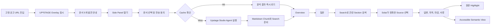
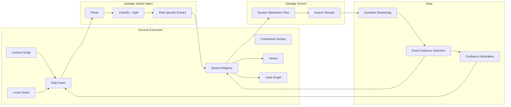
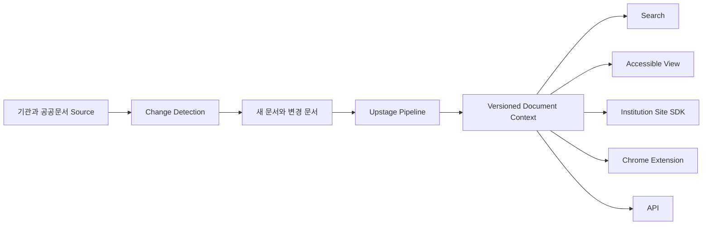

# UP²STAGE 종합 마스터 보고서

> **Unfold Pages to Structured, Trusted, Accessible Guidance for Everyone.**  
> **페이지를 모두를 위한 구조화되고 신뢰할 수 있는 접근 가능한 안내로 펼치다.**

- 문서 버전: v1.0
- 작성 기준일: 2026-08-23
- 프로젝트명: **UP²STAGE**
- 코드와 파일 표기: `UP2STAGE`, `up2stage`
- 팀명: **GOODMORNING**
- 팀 번호: **42**
- 핵심 플랫폼: **Chrome Extension**
- 핵심 기술: **Upstage Studio, Document Parse, Document Classify, Information Extract, Search API, Solar**
- 대표 사용자: 장학금, 생활지원, 교내외 프로그램을 스스로 찾아 신청하는 한국 학부 재학생
- 확장 사용자: 일반 웹 사용자, 문서 접근성이 필요한 사용자
- 대표 데모: 서울대학교 2026년 상반기 서울인재대학장학금 공고와 첨부문서 묶음
- P0 아키텍처: UP²STAGE 소유 서버 없이 Chrome Extension이 Upstage API와 직접 통신
- P0 검색 구조: Embed 2와 로컬 벡터 DB를 사용하지 않고 Upstage Search API 사용
- 향후 검색 구조: 동일한 Chunk, Source, Retriever 계약을 유지하면서 로컬 RAG로 교체
- 사업화 출발점: **B2C는 최종 수익모델을 단정하기 위한 것이 아니라 실제 사용자 수요와 반복 사용성을 검증하기 위한 시작점**

---

## 0. 이 문서의 목적과 상태 표기

이 문서는 기존 제품 마스터 보고서, Upstage Studio Agent 설정, Search 기반 Retrieval 설계, 접근성 설계, Chrome Extension 구조, 부스 피드백과 이후 팀 회의에서 확정한 내용을 UP²STAGE라는 새 프로젝트명 아래 다시 통합한 실행 기준 문서입니다.

기존 문서를 단순히 이름만 바꿔 재사용하지 않고, 다음 네 가지 축으로 다시 작성합니다.

1. **현재 3일 데모에서 실제 구현할 범위**
2. **제품이 기존 LLM 문서 요약 서비스와 다른 구조적 이유**
3. **접근성을 제품의 주요 차별축으로 강화하는 방식**
4. **B2C 수요 검증에서 B2B, B2G, 기관 사이트 내장형 제품으로 확장되는 사업 구조**

문서 안의 상태는 다음과 같이 구분합니다.

| 상태 | 의미 |
|---|---|
| **확정** | 팀이 현재 P0 또는 발표 방향으로 선택한 내용 |
| **P0 구현** | 해커톤 데모에서 실제 동작해야 하는 내용 |
| **P0 데모 최적화** | 고정 URL, 로컬 캐시 등 데모 신뢰도를 높이기 위한 제한 구현 |
| **Next** | P0 이후 가까운 제품 개선 |
| **Future** | 실제 서비스와 사업 확장을 위한 구조 |
| **가설** | 사용자, 가격, 지불 주체 또는 기술 품질 검증이 필요한 내용 |
| **POC 필요** | 공식 계약이나 실제 계정 동작을 실행으로 확인해야 하는 내용 |

---

# Part I. 프로젝트 정의와 제품 철학

## 1. 프로젝트명과 키 문장

### 1.1 공식 프로젝트명

```text
UP²STAGE
```

발표, 장표, 데모 UI, 문서 제목에서는 `UP²STAGE`를 사용합니다. 코드, URL, 파일명, 환경변수처럼 위첨자 사용이 어려운 곳에서는 `UP2STAGE` 또는 `up2stage`를 사용합니다.

### 1.2 공식 확장형 문장

> **Unfold Pages to Structured, Trusted, Accessible Guidance for Everyone.**

### 1.3 공식 한국어 키 문장

> **페이지를 모두를 위한 구조화되고 신뢰할 수 있는 접근 가능한 안내로 펼치다.**

### 1.4 제품 구조와 문장의 대응

| 키워드 | UP²STAGE에서의 의미 |
|---|---|
| **Unfold Pages** | 웹페이지와 여러 첨부문서를 하나의 Case로 펼칩니다. |
| **Structured** | Parse, Classify, Extract, Section Chunking으로 구조를 복원합니다. |
| **Trusted** | 모든 중요한 사실을 Source ID, 페이지, 원문, 좌표로 되돌립니다. |
| **Accessible** | 같은 문서 구조를 화면, 키보드, 스크린 리더가 함께 사용합니다. |
| **Guidance** | 요약에서 끝나지 않고 자격, 서류, 마감, 위험, 다음 행동으로 연결합니다. |
| **for Everyone** | 대학생이라는 좁은 P0에서 시작하되, 접근성 및 기관 내장형 구조로 이용 범위를 넓힙니다. |

`for Everyone`은 P0의 Target User를 모호하게 만드는 표현이 아닙니다. P0 사용자는 한국 학부 재학생으로 고정합니다. Everyone은 제품의 장기 접근성 원칙과 정보 접근 권리를 나타냅니다.

### 1.5 보조 제품 문장

공식 키 문장을 대체하지 않고 상황에 따라 함께 사용할 수 있는 보조 문장입니다.

- **웹페이지와 첨부문서를 검증 가능한 안내로 펼칩니다.**
- **한 페이지와 그 문서들을 하나의 신뢰 가능한 행동 계획으로 바꿉니다.**
- **Every Answer Has a Place.**
- **Visual In, Semantic Out.**
- **One Page In, One Verified Action Plan Out.**
- **Accurate, Verifiable, Accessible.**

### 1.6 Upstage와 UP²STAGE 표기 구분

| 표기 | 의미 |
|---|---|
| **Upstage** | 트랙 파트너 및 기술 플랫폼 회사명 |
| **UP²STAGE** | GOODMORNING 팀의 프로젝트명 |
| `up2stage` | 코드, 패키지, 파일 ID용 이름 |

프로젝트명의 언어유희보다 중요한 것은 Upstage 기술의 쓰임을 제품 구조로 증명하는 것입니다. 발표에서는 이름의 재치보다 `Structured`, `Trusted`, `Accessible Guidance`가 실제 데모에서 어떻게 만들어지는지를 먼저 보여줍니다.

---

## 2. 한 문장 제품 정의

> **UP²STAGE는 사용자가 현재 보고 있는 웹페이지와 연결된 여러 문서를 발견하고, 서로 다른 형식의 문서를 하나의 검증 가능한 Case로 구성한 뒤, 자격조건, 기한, 필요서류, 주의사항과 다음 행동을 원문 근거와 함께 제공하는 Chrome Extension 기반 Document Agent입니다.**

UP²STAGE는 다음 중 하나로 정의하지 않습니다.

- AI PDF Reader
- 단순 Document Chat
- 파일 업로드형 요약기
- HWP Viewer
- VoiceOver 전용 도구
- 일반 목적 Browser Agent

권장 제품 카테고리는 다음입니다.

> **The Browser's Document Intelligence and Accessibility Layer**

---

## 3. 해결하려는 문제

### 3.1 문제의 본질

대학생에게 필요한 기회가 없는 것이 아닙니다. 기회가 공지사항, PDF, HWP, 신청서, 기준표와 매뉴얼 사이에 흩어져 있습니다.

사용자는 하나의 신청을 위해 다음 과정을 직접 수행해야 합니다.

```text
공고 발견
→ 게시글 본문 읽기
→ 첨부문서의 중요도 판단
→ PDF, HWP, XLSX 등을 하나씩 열기
→ 각 문서의 역할 구분
→ 조건과 예외 통합
→ 자신의 상황과 대조
→ 필수서류와 조건부 서류 구분
→ 여러 마감과 제출 채널 구분
→ 서명, 파일명, 병합, 제출 순서 준수
→ 접수 상태 확인
```

문제는 학생의 문해력이 무너졌다는 데 있지 않습니다. 한 번의 결정을 위해 여러 출처와 형식의 정보를 탐색하고 통합하며 검증해야 하는 비용에 있습니다.

### 3.2 Document Set 문제

UP²STAGE의 기본 처리 단위는 문서 한 개가 아닙니다.

```text
웹페이지
├─ 공고문 PDF 또는 HWP
├─ 신청서 HWP 또는 DOCX
├─ 자가 체크리스트 HWP
├─ 기관 목록 또는 기준표 XLSX
├─ 신청방법 PDF
├─ FAQ
└─ 정정 공고
        ↓
하나의 사용자 의사결정
```

### 3.3 행정 부담 관점

| 부담 | 사용자가 수행하는 작업 | UP²STAGE가 줄이는 방식 |
|---|---|---|
| Learning cost | 문서 발견, 역할 구분, 조건 탐색, 정보 통합 | 첨부 발견, 문서 역할 분류, 통합 Overview |
| Compliance cost | 서류 준비, 서명, 병합, 채널과 마감 준수 | 서류 체크리스트, 절차, 위험, Action Plan |
| Psychological cost | 내가 해당되는지, 빠뜨린 것이 없는지에 대한 불확실성 | 근거, 미확인 정보, 충돌, 3단계 판정 |

P0는 Learning cost와 Compliance cost를 직접 줄이는 데 집중합니다. Psychological cost 감소는 사용자 검증 항목입니다.

---

## 4. 대표 사용자와 확장 사용자

### 4.1 Primary User

> **장학금, 생활지원, 교내외 프로그램을 스스로 찾아 신청해야 하고, 공고의 자격조건과 여러 첨부문서를 직접 확인하는 한국 학부 재학생**

### 4.2 대표 상황

- 장학금 신청
- 기숙사 입사 신청
- 교환학생 지원
- 인턴십 지원
- 공모전 제출
- 연구지원 신청
- 학자금대출 안내
- 교내외 프로그램 신청

P0는 장학금 공고를 대표 Case로 고정합니다.

### 4.3 확장 사용자

- 일반 공공지원사업 신청자
- 복잡한 행정문서를 읽는 일반 시민
- 문서 접근성이 필요한 사용자
- 공고를 게시하고 문의를 처리하는 대학, 재단, 공공기관 담당자

### 4.4 Everyone의 적용 원칙

```text
P0 Target
= 한국 학부 재학생

Product Architecture
= 여러 형식의 복잡한 문서를 다루는 범용 구조

Accessibility Principle
= 누구나 자신에게 맞는 방식으로 같은 문서를 탐색
```

---

## 5. 대표 데모 Case

### 5.1 입력

```text
2026 서울인재대학장학금 공고 페이지
├─ 핵심 공고 또는 기준 문서
├─ 자기소개서
├─ 자가 체크리스트
├─ 신청 가능 대학 목록
└─ 신청방법 안내
```

### 5.2 사용자 정보 예시

```json
{
  "university": "서울대학교",
  "year": 2,
  "income_bracket": 3,
  "grade_percentile": 92
}
```

### 5.3 대표 질문

> 나는 서울대학교 2학년이고 학자금 지원 3구간, 전체 평점 백분위 92점입니다. 지원할 수 있나요? 언제까지 무엇을 준비해야 하며 판단 근거는 어디인가요?

### 5.4 기대 결과

```text
현재 입력 기준
- 학년 조건: 충족
- 지원구간 조건: 충족
- 성적 조건: 충족
- 입력되지 않은 조건: 확인 필요

마감
- 2026년 3월 31일 16:00

해야 할 일
1. 신청 가능 대학 목록에서 소속 확인
2. 자기소개서 작성
3. 자가 체크리스트 완료
4. 신청방법 안내에 따라 제출

근거
- 각 조건 옆에 파일명, 페이지, 원문 문장과 Highlight 제공
```

---

# Part II. 제품 핵심 구조

## 6. 네 가지 핵심 제품 개념

### 6.1 Page-to-Document Case

현재 웹페이지와 연결된 첨부문서를 관계가 있는 하나의 Case로 유지합니다.

### 6.2 One Evidence Model

다음 경험이 모두 같은 Source ID를 사용합니다.

```text
AI 답변
자격 판정
원문 Highlight
Semantic Document
키보드 Focus
VoiceOver 안내
Action Plan의 근거
```

### 6.3 Evidence-grounded Actionability

UP²STAGE는 답변에서 끝나지 않습니다.

```text
질문
→ 판단
→ 판단 근거
→ 미확인 정보
→ 필요서류
→ 마감
→ 위험
→ 다음 행동
```

### 6.4 Visual, Semantic, Intelligence의 세 Layer

```text
┌─────────────────────────────────────────────┐
│ Intelligence Guidance Layer                 │
│ 자격, 마감, 위험, 의미, Action, Evidence    │
├─────────────────────────────────────────────┤
│ Semantic Accessibility Layer                │
│ Heading, Paragraph, List, Table, Order      │
├─────────────────────────────────────────────┤
│ Visual Source Layer                         │
│ 원본 PDF, HWP, Office Page Image            │
└─────────────────────────────────────────────┘
```

세 Layer는 별개의 제품이 아닙니다. 동일한 Source Record를 서로 다른 방식으로 표현합니다.

---

## 7. 기존 LLM 요약과의 차이

UP²STAGE는 범용 LLM보다 무조건 더 똑똑하다고 주장하지 않습니다. 차이는 결과의 형태와 검증 계약에 있습니다.

| 일반 LLM 문서 요약 | UP²STAGE |
|---|---|
| 문서 또는 파일을 Prompt Context로 사용 | 페이지와 첨부문서를 하나의 Case로 구성 |
| 자유 형식 답변 | 역할별 Extract와 Canonical Data |
| 출처가 문장 또는 페이지 수준에 머물 수 있음 | Source ID, Element, Page, Polygon 연결 |
| 요약과 원문 구조가 분리될 수 있음 | Answer, Viewer, Accessibility가 같은 구조 사용 |
| 문서 전체를 반복해서 넣을 수 있음 | Section Search로 후보를 좁힌 뒤 Exact Evidence 선택 |
| 불확실성을 답변으로 덮을 수 있음 | `needs_more_information`, conflict, missing evidence 유지 |

핵심 차별 문장은 다음입니다.

> **UP²STAGE는 문서를 답변으로 압축하지 않습니다. 문서를 구조화되고 검증 가능하며 접근 가능한 안내로 다시 연결합니다.**

---

# Part III. P0, Next, Future 범위

## 8. P0 범위

### 8.1 문서 획득

- 고정 데모 URL 진입 감지
- URL 규칙 기반 Contextual Overlay 표시
- 사용자가 Overlay 또는 Extension Action으로 Side Panel 열기
- 현재 페이지 본문 분석
- 직접 연결된 첨부문서 후보 발견
- 사용자가 분석 문서 선택
- Upstage 전송 대상과 목적 표시
- 명시적 승인 후 문서 Fetch와 Upload
- 최대 5개 문서로 하나의 Case 구성

### 8.2 Upstage 처리

- Studio File Upload
- Document Parse
- Classify + Split by file
- 역할별 Information Extract
- Parse Element와 Coordinates 보존
- Extract Location 보존
- Parse 결과를 Canonical Markdown으로 정규화
- SectionChunker로 검색 단위 생성
- Upstage Search API에 Chunk 등록
- Solar를 통한 질문 응답과 Exact Evidence 선택

### 8.3 사용자 결과

- 빠른 요약
- 자격조건과 제외조건
- 일정과 마감
- 필수서류와 조건부 서류
- 신청 절차
- 주의사항과 탈락 위험
- 확인할 수 없는 정보
- 문서 간 충돌
- 다음 행동
- 원문 근거와 Highlight
- Accessible Semantic View
- 키보드와 VoiceOver 탐색

### 8.4 P0 데모 최적화

- 고정 URL 규칙 기반 Overlay
- 동일 공개 문서에 대한 로컬 Cache
- Cache Hit 시 사전 분석 결과 사용 사실 표시
- Cache Miss 시 Live Upstage Pipeline 실행
- 데모 실패 시 공개된 사전 분석 결과 Fallback

P0 Cache는 Context Layer라고 부르지 않습니다. 동일 Case의 처리시간을 줄이는 로컬 데모 최적화입니다.

---

## 9. P0에서 제외하는 기능

- 여러 공고 사이트의 정기 수집
- 기관 공고 전체의 사전 Index
- 서버 기반 공유 Context Layer
- 실제 신청 제출
- 이메일 자동 전송
- 캘린더와 Reminder 직접 쓰기
- 여러 웹사이트를 넘는 자율 탐색
- Solar의 임의 URL Fetch
- 모든 포맷의 완전한 원본 렌더링
- 모든 문서의 완전한 WCAG 준수 보장
- Production API Key Proxy
- Embed 2 기반 검색
- 로컬 Vector RAG
- 모든 Workflow Branch 구현

---

## 10. Next 범위

- 정정공고 Diff
- 문서 변경 감지
- Context Cache 재사용
- Search Query Rewrite
- Workflow Router
- 학사행정, 행사참여 Workflow
- 복잡한 표 접근성
- Multi-page table
- Solar Tool Calling
- 같은 Entity의 문서 간 통합
- Local RAG Adapter
- 기관 대상 파일럿

---

## 11. Future 범위

- Shared Document Context Layer
- 기관별 Source Connector와 Change Detection
- 이미 분석된 공개문서의 Context 재사용
- 기관 사이트 내장형 SDK 또는 Web Component
- B2B Site License
- B2G 공공문서 접근성 제공
- Document Intelligence API
- Personal Document Memory
- Calendar, Reminder, Siri, App Intents
- Production Backend Proxy
- Chrome Web Store 배포
- 기관별 권한, 버전, 운영 Dashboard

---

# Part IV. 사용자 경험

## 12. P0 데모 사용자 흐름



### 12.1 Contextual Overlay

고정 데모 URL에 들어오면 페이지 한쪽에 작은 진입점을 표시합니다.

```text
UP²STAGE
이 페이지에서 5개의 관련 문서를 찾았습니다.
[문서 안내 펼치기]
```

Overlay는 다음을 자동 실행하지 않습니다.

- 첨부파일 Fetch
- Upstage Upload
- 문서 외부 전송

사용자가 버튼을 눌러 Side Panel에 들어간 뒤 선택과 동의를 완료해야 합니다.

### 12.2 Side Panel

Side Panel은 다음 상태를 가집니다.

1. 현재 페이지 인식
2. 첨부문서 후보
3. 문서 선택과 전송 동의
4. 분석 단계 상태
5. Overview
6. 질문과 Quick Action
7. 근거 보기
8. Accessible View 열기

### 12.3 Quick Actions

- 이 공고 전체 이해하기
- 나는 신청할 수 있나요?
- 무엇을 준비해야 하나요?
- 언제까지 해야 하나요?
- 탈락 조건과 주의사항 알려줘
- 문서 간 다른 내용을 찾아줘
- 모든 근거 보기
- 구조화된 문서 열기
- 목차만 보여줘

---

## 13. 접근성 데모 흐름

접근성은 별도의 마지막 Feature가 아니라 데모의 핵심 장면으로 포함합니다.

### 13.1 시각적 Layer 전환

```text
1. 원본 Page Image
2. Heading, Paragraph, Table 영역이 표시되는 Semantic Layer
3. Eligibility, Deadline, Required Document가 표시되는 Intelligence Layer
```

### 13.2 목차 탐색 데모

사용자가 `목차만 보여줘`를 선택합니다.

```text
H1  2026 서울인재대학장학금
H2  지원 자격
H2  신청 기간
H2  제출 서류
H2  신청 방법
H2  유의사항
```

키보드로 Heading을 이동할 때 다음을 함께 보여줍니다.

- Semantic View Focus
- 원본 Page Highlight
- 현재 Heading의 의미 안내
- VoiceOver 음성

### 13.3 해석된 접근성 안내

원문 의미를 임의로 대체하지 않고, Source와 구분된 AI 설명을 추가합니다.

예:

```text
원문 Heading: 지원 자격

Semantic 안내:
지원 자격, Heading Level 2

Intelligence 안내:
지원 자격에는 학년, 학자금 지원구간, 성적, 소속 대학 조건이 포함됩니다.
AI가 생성한 안내입니다.
```

### 13.4 접근성 데모 원칙

- 원문 구조와 AI 설명을 구분합니다.
- AI 설명은 citation의 원본이 아닙니다.
- 사용자는 원문 문장과 페이지로 돌아갈 수 있습니다.
- VoiceOver 사용자만을 위한 별도 문서를 만들지 않습니다.
- 시각 사용자, 키보드 사용자, 스크린 리더 사용자가 같은 Semantic Model을 사용합니다.

---

# Part V. 전체 시스템 아키텍처

## 14. 전체 구조



### 14.1 계층별 책임

| 계층 | 책임 |
|---|---|
| Chrome Extension | 현재 URL, 문서 발견, 동의, Cache, Source Registry, Graph, UI |
| Studio Parse | 문서 구조, 읽기 순서, HTML, Markdown, Element, Coordinates |
| Studio Classify | 파일 또는 문서 조각의 역할 분류 |
| Studio Extract | 역할별 사실, 조건, 서류, 마감, Location |
| Search API | 질문과 관련 있는 문서와 Section 후보 검색 |
| Solar | 후보 Source 중 실제 근거 선택, 예외 설명, 사용자 안내 |
| Viewer | 원본 Page, Highlight, Semantic Focus, VoiceOver |

---

## 15. Chrome Extension 구성

### 15.1 Content Script

- 고정 URL 또는 URL Pattern 확인
- Overlay 삽입
- 게시글 본문 추출
- 첨부 링크 후보 발견
- DOM의 파일명, 링크 텍스트, MIME 힌트 수집
- 페이지 변화 감지

### 15.2 Side Panel

- 사용자 동의
- 문서 선택
- 처리 단계 상태
- Overview
- 질문
- Quick Action
- Cache 상태
- 오류와 재시도

### 15.3 Service Worker

- Extension Action 처리
- Side Panel 열기
- Content Script 주입
- 권한 요청
- 탭과 Session 연결
- 짧은 메시지 라우팅

긴 Polling, 대용량 업로드, JSON 정규화는 Side Panel 또는 Viewer Page에서 수행합니다.

### 15.4 Viewer Page

- Page Image 표시
- Polygon Overlay
- Semantic Document
- Keyboard Focus
- VoiceOver 상태 안내
- Source Jump

### 15.5 Local State

#### `chrome.storage.session`

- API Key
- 현재 Tab Session
- 선택 문서 Metadata
- Job ID
- 현재 단계

#### IndexedDB

- Document Blob
- Parse Result
- Extract Result
- Search Registry
- Markdown Chunk
- Page Image Cache
- Canonical Case Graph
- Demo Cache

---

# Part VI. Upstage Studio Agent

## 16. Agent 이름과 Node Flow

### 16.1 Agent 이름

```text
UP²STAGE Document Intelligence v1
```

코드용:

```text
up2stage-document-intelligence-v1
```

### 16.2 P0 Flow

```mermaid
flowchart LR
    A[Parse] --> B[Classify + Split by file]
    B -->|core_notice| C[Core Notice Extract]
    B -->|amendment_notice| D[Amendment Extract]
    B -->|eligibility_rules| E[Eligibility Extract]
    B -->|self_checklist| F[Self Checklist Extract]
    B -->|application_form| G[Application Form Extract]
    B -->|procedure_guide| H[Procedure Extract]
    B -->|institution_list| I[Institution List Extract]
    B -->|reference| J[Reference Extract]
    B -->|other| K[Skip]
```



Instruct는 P0 필수 Node로 두지 않습니다. 여러 Branch 결과를 하나의 Instruct가 안정적으로 받는 것이 확인되면 요약 또는 Readiness 판단에 제한적으로 사용합니다.

---

## 17. Parse 설정

| 설정 | P0 값 |
|---|---|
| Mode | Auto |
| OCR | Images only 또는 현재 UI의 Auto |
| Language | Korean |
| Coordinates | ON |
| Output | HTML, Markdown, Text |
| Chart recognition | 기본 OFF |
| Merge multi-page tables | 대표 문서 POC 후 결정 |
| Image extraction | 접근성 데모에 필요한 경우 ON |
| DPI | 기본 150, 작은 글자 오류 시 200 또는 300 |
| Nightly | OFF |

실패 시 순서:

```text
OCR Always
→ Mode Advanced
→ DPI 300
→ 더 선명한 원본
```

---

## 18. Classify + Split

### 18.1 Split

P0 기본값:

```text
Split by file
```

한 파일 안에 여러 문서가 붙어 있는 사례는 `Auto-detect documents`를 P1에서 검증합니다.

### 18.2 문서 역할 Taxonomy

| Machine Key | 화면명 | 분류 기준 |
|---|---|---|
| `core_notice` | 핵심 공고 | 프로그램 목적, 대상, 혜택, 기간, 전체 신청방법 |
| `amendment_notice` | 정정 또는 변경 공고 | 이전 공고의 값이나 절차를 변경, 대체 |
| `eligibility_rules` | 자격 기준 | 학년, 소득, 성적, 학적, 거주, 제외, 예외 |
| `self_checklist` | 자가 체크리스트 | 사용자가 항목을 확인하며 자격을 점검 |
| `application_form` | 신청 양식 | 신청서, 자기소개서, 추천서, 동의서 |
| `procedure_guide` | 신청 절차 안내 | 제출 순서, URL, 채널, 파일 규칙, 완료 확인 |
| `institution_list` | 대상 기관 목록 | 신청 가능 대학, 기관, 연구실, 지역 목록 |
| `reference` | 참고자료 | 환산표, FAQ, 보조 기준, 사례 |
| `other` | 기타 | 어느 유형에도 안정적으로 해당하지 않음 |

모든 Description은 한국어로 자세히 작성합니다. Machine Key는 영어로 유지합니다.

---

## 19. 역할별 Extract Schema

### 19.1 공통 원칙

- 역할마다 작은 Schema 사용
- 긴 문자열보다 Atomic List와 Table 사용
- 모든 중요한 필드에 Location 활성화
- 원문 표현과 정규화된 값을 구분
- 없는 값을 추론하지 않음
- Summary 문장보다 재사용 가능한 Fact 생성

### 19.2 Core Notice Extract

```text
program_name
provider
benefits[]
application_periods[]
selection_schedule[]
contact[]
core_cautions[]
```

`application_periods` 예시:

| phase | start | deadline | raw_text |
|---|---|---|---|
| 온라인 신청 | 2026-03-01 | 2026-03-31 16:00 | 원문 표현 |

### 19.3 Amendment Extract

```text
target_notice
effective_date
changed_items[]
superseded_documents[]
amendment_cautions[]
```

`changed_items` 예시:

| field | before | after | raw_text |
|---|---|---|---|
| 신청 마감 | 3월 30일 18시 | 4월 2일 16시 | 원문 표현 |

### 19.4 Eligibility Extract

```text
eligibility_conditions[]
exclusion_conditions[]
exceptions[]
required_evidence[]
eligibility_cautions[]
```

P1 정규화:

| field | 의미 |
|---|---|
| rule_type | 학년, 소득, 성적, 거주, 학적 |
| operator | 이상, 이하, 초과, 포함 |
| value | 기준값 |
| unit | 학년, 구간, 점수 |
| scope | 대상 범위 |
| exception | 예외 |
| raw_text | 원문 |

### 19.5 Self Checklist Extract

```text
checklist_title
checklist_items[]
required_confirmations[]
failure_conditions[]
```

### 19.6 Application Form Extract

```text
form_name
required_fields[]
signatures[]
attachments[]
form_cautions[]
```

### 19.7 Procedure Extract

```text
application_steps[]
submission_channels[]
file_rules[]
completion_checks[]
procedure_cautions[]
```

### 19.8 Institution List Extract

```text
list_title
institutions[]
inclusion_rules[]
institution_cautions[]
```

### 19.9 Reference Extract

```text
reference_type
reference_rules[]
qa_pairs[]
reference_cautions[]
```

### 19.10 Other

`other`는 Extract에 연결하지 않습니다. 문서명, 파일명, 분류 사유만 보존합니다.

---

# Part VII. Parse 결과와 Search 구조

## 20. Canonical Document와 Source

### 20.1 Document Record

```ts
type DocumentRecord = {
  id: string;
  caseId: string;
  role: DocumentRole;
  title: string;
  filename: string;
  mimeType: string;
  originalUrl?: string;
  upstageFileId?: string;
  pageCount?: number;
  status: "candidate" | "processing" | "ready" | "failed";
};
```

### 20.2 Source Record

```ts
type SourceRecord = {
  id: string;
  caseId: string;
  documentId: string;
  documentRole: DocumentRole;
  page: number;
  elementId?: string | number;
  category: string;
  text: string;
  polygon?: Array<{ x: number; y: number }>;
  bbox?: [number, number, number, number];
  confidence?: number | "high" | "medium" | "low";
};
```

### 20.3 Source ID 규칙

```text
case:{caseId}:doc:{documentId}:page:{page}:element:{elementId}
```

예:

```text
case:seoul-talent-2026:doc:notice:page:3:element:17
```

Source ID는 Extension이 실제 Parse 결과에서 생성합니다. Solar와 Instruct가 새 ID를 만들지 않습니다.

---

## 21. 문서 Markdown 생성

### 21.1 목적

Parse Markdown을 그대로 Search에 넣지 않습니다. 검색과 Source Mapping을 위해 Canonical Markdown을 생성합니다.

### 21.2 모든 Chunk에 포함할 문서 Context

- 문서 H1
- 검색용 문서 요약
- 문서 역할
- Section Path
- 현재 Section Heading
- 본문
- Source Element ID 목록
- Page 범위

### 21.3 문서 H1

원본 제목이 있으면 사용합니다. 제목이 없으면 다음 순서로 생성합니다.

```text
Parse document title
→ 첫 페이지 주요 Heading
→ 파일명에서 확장자 제거
```

생성된 제목은 `generated_title: true`로 표시하며 citation 대상이 아닙니다.

### 21.4 검색용 문서 요약

요약은 다음 정보를 짧게 포함합니다.

```text
문서 종류
대상
주요 내용
관련 문서
```

예:

```text
문서 종류: 핵심 공고
대상: 대학생 장학금 지원자
주요 내용: 자격, 혜택, 기간, 제출서류, 신청 절차
관련 문서: 체크리스트, 자기소개서, 신청방법, 대학 목록
```

요약은 `retrieval_context_only: true`로 저장합니다. 최종 답변의 citation으로 사용하지 않습니다.

---

## 22. SectionChunker

### 22.1 기본 원칙

H2가 있으면 우선 사용하지만 H2가 없는 긴 문서도 처리합니다. 구현 이름은 `H2Chunker`가 아니라 `SectionChunker`입니다.

### 22.2 Boundary 우선순위

```text
1. 명시적 Heading
2. 번호 또는 조항 구조
3. 독립 표, 목록, 양식 블록
4. Parse의 시각적 Heading 후보
5. 길이 기반 분할
6. 의미 기반 Topic Boundary
```

P0는 1에서 5까지 구현합니다. 6은 P1입니다.

### 22.3 Heading 규칙

- H2를 기본 Section Boundary로 사용
- H2가 없고 H3만 있으면 H3를 승격
- 첫 H1은 문서 제목으로 고정
- 반복 H1은 Section Heading 후보
- Heading Level이 섞이면 번호 패턴과 Semantic Order 사용

### 22.4 번호와 조항 패턴

```text
1.
1-1.
1.1
가.
나.
①
②
제1조
제2조
제1장
제2절
붙임 1
별첨 2
[서식 1]
```

### 22.5 표와 목록

#### 표

- 표 제목과 표 본문을 같은 Chunk에 둠
- 길면 행 단위 분할
- 분할 Chunk마다 H1, 문서 요약, 표 제목, Header Row 반복
- Table Element ID와 Page 범위 저장

#### 목록

- 의미 있는 목록을 중간에서 자르지 않음
- 길면 번호 또는 하위 Heading 단위로 분할
- Parent Heading을 반복 포함

### 22.6 길이 규칙

| 항목 | 초기값 |
|---|---:|
| 목표 Chunk 길이 | 약 700 tokens |
| 최대 Chunk 길이 | 약 1,200 tokens |
| 최소 Chunk 길이 | 약 180 tokens |
| 최대 Overlap | 1개 문단 또는 약 120 tokens |

### 22.7 큰 Section 분할

```text
H3 또는 하위 Heading
→ 번호 항목
→ 독립 표 또는 목록
→ 문단 묶음
→ Token Window
```

### 22.8 작은 Section 병합

- 같은 Parent 아래 인접 Section과 병합
- 원래 Section Heading은 본문에 유지
- 서로 다른 상위 Heading을 넘지 않음

### 22.9 Page Boundary

페이지는 기본 Chunk Boundary가 아닙니다. 구조 경계가 없거나 한 페이지가 독립 양식인 경우에만 보조 경계로 사용합니다.

### 22.10 의미 기반 분할

P1에서 Solar 또는 Instruct가 Topic Boundary 후보만 생성합니다.

- 원문 순서 변경 금지
- Source Element 경계 유지
- 생성 Heading은 `generated_heading: true`
- 생성 Heading은 citation 대상 제외

---

## 23. Search용 Markdown Chunk

### 23.1 원칙

P0에서는 Section Chunk 하나를 Markdown 파일 하나로 만들어 Upstage Search에 등록합니다.

### 23.2 Frontmatter 예시

```yaml
---
case_id: seoul-talent-2026
chunk_id: chunk_notice_eligibility_01
document_id: doc_notice
source_file_id: upstage_file_123
section_id: eligibility
section_heading: 지원 자격
section_path: 모집 공고 > 지원 자격
document_role: core_notice
page_start: 2
page_end: 3
source_element_ids:
  - case:seoul-talent-2026:doc:notice:page:2:element:11
  - case:seoul-talent-2026:doc:notice:page:3:element:17
retrieval_context_only_summary: true
---
```

### 23.3 본문 예시

```markdown
# 2026 서울인재대학장학금 모집공고

> 문서 요약
> 서울 소재 대학 재학생을 대상으로 하는 장학금 모집공고입니다.
> 자격, 신청기간, 혜택, 제출서류와 신청 절차를 포함합니다.

경로: 모집 공고 > 지원 자격

## 지원 자격

- 신청일 기준 학부 재학생
- 2학년 이상
- 학자금 지원구간 4구간 이하
- 전체 성적 백분위 90점 이상
```

### 23.4 파일명

```text
{caseId}__{documentId}__{sectionId}__{chunkIndex}.md
```

---

# Part VIII. Search, Solar, Evidence

## 24. Search Index Registry

```ts
type SearchChunkRecord = {
  chunkId: string;
  caseId: string;
  documentId: string;
  documentRole: DocumentRole;
  sectionId: string;
  sectionHeading: string;
  sectionPath: string[];
  sourceElementIds: string[];
  pageStart: number;
  pageEnd: number;
  searchFileId?: string;
  searchIndexStatus: "pending" | "uploaded" | "indexed" | "failed";
};
```

ID 계층:

```text
Case ID
└─ Document ID
   └─ Chunk ID
      ├─ Search File ID
      └─ Source Element IDs[]
```

Search File ID와 Parse Element ID를 동일하게 만들지 않습니다. Registry로 연결합니다.

---

## 25. Upstage Search의 역할

Search는 최종 답변이나 정확한 Polygon을 결정하지 않습니다.

```text
Search의 책임
= 관련 문서, Section, Chunk 후보 찾기

Solar의 책임
= 후보 중 실제 답변 근거 선택

Source Resolver의 책임
= Source ID를 Page와 Polygon으로 연결
```

### 25.1 기본 흐름

```text
사용자 질문
→ Upstage Search
→ 관련 Chunk Top-K
→ Search File ID
→ Registry에서 Document ID와 Source Element 후보 확인
→ Solar에 후보 전달
→ Exact Source ID 선택
→ Citation Validator
→ Viewer Highlight
```

### 25.2 초기 검색값

```text
top_k = 5
```

근거를 찾지 못하면 10으로 확장합니다.

### 25.3 Search Adapter

```ts
type SearchHit = {
  searchFileId: string;
  chunkId: string;
  documentId: string;
  score?: number;
  matchedText?: string;
  rank: number;
};

interface Retriever {
  search(query: string, options?: {
    caseId?: string;
    topK?: number;
  }): Promise<SearchHit[]>;
}
```

P0:

```text
UpstageSearchRetriever
```

Future:

```text
LocalRAGRetriever
```

상위 Q&A, Viewer, Graph는 Retriever 교체의 영향을 받지 않습니다.

---

## 26. Solar Exact Evidence Selection

### 26.1 입력 예시

```text
사용자 질문:
학자금 지원 3구간이면 지원 가능한가요?

검색된 문서:
2026 서울인재대학장학금 모집공고

검색된 Section:
지원 자격

후보 Source:
[S1] p3:e17 "학자금 지원구간 4구간 이하"
[S2] p3:e18 "직전학기 백분위 90점 이상"
[S3] p3:e19 "2학년 이상"

규칙:
1. 제공된 Source ID 중 질문에 직접 근거가 되는 것만 선택합니다.
2. Source ID를 새로 만들지 않습니다.
3. 문서 요약은 근거로 사용하지 않습니다.
4. 정보가 부족하면 needs_more_information을 반환합니다.
```

### 26.2 Evidence Selection 응답

```json
{
  "status": "answerable",
  "selected_source_ids": ["S1"],
  "needs_more_context": false,
  "missing_information": []
}
```

Status:

```text
answerable
needs_more_information
conflicting_sources
not_found
```

### 26.3 Citation Validator

- 반환 ID가 후보 Set에 존재해야 함
- 현재 Case에 속해야 함
- Source Record에 Page와 Text가 있어야 함
- Highlight에 Polygon 또는 Page Fallback이 있어야 함
- 존재하지 않는 ID는 폐기
- 모든 Citation이 무효면 Grounded 상태로 표시하지 않음

### 26.4 실패 Fallback

```text
Top-K 확대
→ 같은 문서의 인접 Chunk 추가
→ 다른 역할 문서 검색
→ Page 수준 이동
→ 근거 위치 확인 필요 표시
```

임의 Highlight를 만들지 않습니다.

---

## 27. Solar Q&A 계약

Solar가 담당합니다.

- 질문 해석
- Search 결과 기반 Source 선택
- 복잡한 예외 설명
- 사용자 정보와 조건 비교
- 미확인 정보 질문 생성
- 다음 행동 설명

Solar가 담당하지 않습니다.

- Search Index 관리
- 원본 파일 Fetch
- 임의 URL 접근
- Source ID 생성
- Local DB 직접 수정
- 실제 신청과 외부 Action

### 27.1 응답 Schema

```ts
type GroundedAnswer = {
  status:
    | "answerable"
    | "needs_more_information"
    | "conflicting_sources"
    | "not_found";
  answer: string;
  sourceIds: string[];
  missingInformation: string[];
  actions: Array<{
    label: string;
    sourceIds: string[];
  }>;
};
```

---

# Part IX. Canonical Case Graph

## 28. Graph Layer

### 28.1 Source Graph

```text
Case
→ Document
→ Page
→ Parse Element
```

### 28.2 Semantic Graph

```text
Opportunity
→ Eligibility Rule
→ Required Document
→ Deadline
→ Procedure
→ Benefit
→ Organization
```

### 28.3 Evidence Graph

```text
Semantic Node
→ supported_by
→ Source Record
```

### 28.4 Entity Type

```text
opportunity
eligibility_rule
exclusion_rule
required_document
conditional_document
deadline
submission_method
procedure_step
benefit
organization
form
institution
```

### 28.5 Relation Type

```text
has_eligibility
has_exclusion
requires
conditionally_requires
has_deadline
submitted_via
has_step
provides_benefit
provided_by
supported_by
supersedes
conflicts_with
exception_to
```

### 28.6 Application Intelligence

```ts
type ApplicationIntelligence = {
  workflowType: "application_opportunity";
  program?: GraphEntity;
  eligibilityRules: GraphEntity[];
  exclusionRules: GraphEntity[];
  deadlines: GraphEntity[];
  requiredDocuments: GraphEntity[];
  conditionalDocuments: GraphEntity[];
  forms: GraphEntity[];
  procedures: GraphEntity[];
  benefits: GraphEntity[];
  institutions: GraphEntity[];
  risks: RiskItem[];
  conflicts: ConflictItem[];
  missingInformation: MissingItem[];
  actions: ActionItem[];
  taskProfiles: string[];
  caseVariants: string[];
  specialCases: string[];
};
```

---

## 29. Workflow와 특성

### 29.1 P0 Workflow

```text
application_opportunity
```

### 29.2 Future Workflow Router

```text
application_opportunity
academic_procedure
event_participation
submission_reporting
policy_information
update_change
other
```

### 29.3 Task Profiles

```text
eligibility_driven
document_driven
deadline_driven
form_driven
procedure_driven
benefit_driven
selection_driven
approval_driven
change_driven
reference_driven
```

### 29.4 Case Variants

```text
condition_heavy
exception_heavy
income_threshold
score_threshold
enrollment_status_requirement
residency_requirement
external_verification_required
document_heavy
conditional_documents
signature_required
original_document_required
recent_issue_required
third_party_document
recommendation_required
specific_file_format
single_deadline
multiple_deadlines
staged_deadlines
exact_time_deadline
rolling_application
first_come_first_served
narrative_form
essay_required
checklist_form
multiple_forms
document_screening
interview_stage
recommendation_based
multi_stage_selection
other_variant
```

### 29.5 Special Cases

```text
amended_notice
conflicting_sources
incomplete_bundle
mixed_workflows
version_mismatch
superseded_document
conditional_path
external_dependency
ambiguous_requirement
missing_evidence
duplicate_information
contradictory_deadline
multi_program_bundle
other_special
```

P0에서 명확한 특성은 코드로 결정합니다.

```text
eligibility_conditions 존재
→ eligibility_driven

required_documents 존재
→ document_driven

deadline 2개 이상
→ multiple_deadlines

amendment_notice 존재
→ amended_notice
```

복잡한 의미 관계만 Solar에 요청합니다.

---

## 30. Conflict, Missing Information, Risk

### 30.1 코드 기반 후보 탐지

```text
core_notice 없음
→ incomplete_bundle

같은 종류의 deadline 값이 다름
→ conflict candidate

amendment_notice 존재
→ superseded_document candidate

필수 Extract 비어 있음
→ missing_information

Fact에 Source ID 없음
→ missing_evidence
```

### 30.2 Solar 의미 판단

- 서로 다른 마감이 충돌인지 단계 차이인지
- 정정공고가 무엇을 대체하는지
- 두 문장이 같은 조건을 말하는지
- 어떤 추가 사용자 정보가 필요한지

---

# Part X. Viewer와 접근성

## 31. Viewer 세 Layer

### 31.1 Visual Source Layer

- Upstage Page Image 또는 PDF.js
- 원본 시각 표현
- `aria-hidden="true"`

### 31.2 Interaction Overlay

- Source Polygon Highlight
- Pointer Interaction
- `aria-hidden="true"`

### 31.3 Semantic Accessibility Layer

- Heading
- Paragraph
- List
- Table
- Figure
- Keyboard와 Screen Reader의 실제 탐색 대상

### 31.4 Intelligence Guidance Layer

Semantic Node 위에 다음 정보를 연결합니다.

- 이 Section의 업무 의미
- 자격조건인지, 마감인지, 제출서류인지
- 사용자 질문과의 관련성
- 미확인 조건
- Source Evidence
- 다음 행동

Intelligence Guidance는 Semantic HTML을 대체하지 않습니다. 의미를 덧붙이는 보조 Layer입니다.

---

## 32. Accessible Semantic View

### 32.1 생성 구조

```text
Upstage Parse Result
→ Normalized Semantic Document Model
→ Deterministic HTML Renderer
→ Semantic HTML
```

AI가 최종 HTML을 자유롭게 생성하지 않습니다.

### 32.2 기본 Mapping

| 문서 요소 | HTML |
|---|---|
| 문서 제목 | `<title>`과 visible `<h1>` |
| Heading | `<h1>`에서 `<h6>` |
| Paragraph | `<p>` |
| 순서 목록 | `<ol><li>` |
| 비순서 목록 | `<ul><li>` |
| Table | `<table>`, `<caption>`, `<th>`, `<td>` |
| Figure | `<figure>`, ``, `<figcaption>` |
| Footnote | 링크와 `<aside>` 또는 DPub-ARIA |
| Form Field | native `<input>`, `<label>`, `<fieldset>` |
| Page Boundary | 필요한 경우 `doc-pagebreak` |

### 32.3 P0 접근성

- H1 한 개
- Heading 구조
- Paragraph와 List
- 단순 Table
- `scope="col"`, `scope="row"`
- 키보드 탐색
- VoiceOver Heading Rotor
- 분석 상태 `role="status"`
- 오류 `role="alert"`
- Source Jump 후 Focus 이동

### 32.4 복잡한 표 Fallback

```text
구조 자동 추정이 어려운 표입니다.
- 원본 표 이미지
- 선형화된 셀 목록
- AI가 추출한 핵심 정보
```

### 32.5 대외 표현

권장:

> **문서의 논리 구조를 복원해 키보드와 스크린 리더로 탐색 가능한 Semantic View를 제공합니다.**

피하기:

> 모든 문서를 접근성이 완벽한 문서로 변환합니다.

---

# Part XI. Cache와 Context Layer

## 33. P0 로컬 Cache

### 33.1 목적

- 데모 반복 실행시간 감소
- 동일 문서의 중복 Parse 방지
- Search Index 재등록 방지
- Live API 실패 Fallback

### 33.2 Cache Key

```text
page_url
+ selected_document_urls
+ document_content_hashes
+ agent_config_version
+ chunker_version
```

### 33.3 저장 항목

- Document Metadata
- Parse Result
- Extract Result
- Source Registry
- Markdown Chunks
- Search File IDs
- Application Intelligence
- Page Image Cache

### 33.4 무효화

- 문서 Hash 변경
- Agent Config 변경
- Chunker Version 변경
- 사용자가 강제 재분석

### 33.5 데모 표시

```text
분석 결과를 불러왔습니다.
동일 문서의 사전 분석 Cache를 사용했습니다.
[다시 분석]
```

---

## 34. Future Context Layer

Context Layer는 운영진 피드백에서 나온 큰 제품 아이디어이며 P0 Cache와 구분합니다.



### 34.1 Context Package

```text
원문과 버전
문서 역할
Semantic Sections
Facts와 Rules
Evidence
Accessible Structure
Search Index
변경 내역
```

### 34.2 변경 감지

Future에서는 고정된 5분 간격을 제품 정의로 박지 않습니다.

```text
Scheduled Polling
Event-based Update
HTTP ETag 또는 Last-Modified
Content Hash 비교
기관 CMS Webhook
```

새 문서와 변경 문서만 재처리합니다.

### 34.3 Context Layer의 사업 가치

- 사용자 대기시간 감소
- 처리비용 감소
- 같은 공개문서의 반복 분석 감소
- 기관 사이트와 Extension이 같은 Context 공유
- 정정공고와 버전 관리
- 접근 가능한 문서의 지속 제공

---

## 35. Contextual Browser Experience

### 35.1 P0

고정 URL을 감지해 Overlay를 띄웁니다.

### 35.2 Future

```text
URL Pattern
+ DOM Pattern
+ Attachment Pattern
+ Existing Context 여부
→ Contextual Entry Point
```

### 35.3 내부 참고 레퍼런스

- Honey와 유사한 지점: 사용자가 별도 목적지로 이동하지 않아도 현재 페이지에서 기능이 나타남
- Glean과 유사한 지점: 뒤에서 Context를 미리 구성하고 Search와 Agent가 재사용

발표에서는 해당 서비스명을 제품 정의로 사용하지 않습니다. 개념만 내부 설계 참고로 유지합니다.

---

# Part XII. 사업 모델과 확장 전략

## 36. BM 기본 원칙

> **B2C는 수익모델의 최종 결론이 아니라 실제 사용자 수요와 반복 사용성을 검증하기 위한 시작점입니다.**

UP²STAGE는 학생 사용자가 직접 문제를 경험하는 B2C Surface에서 시작합니다. 이후 실제 사용 데이터, 반복 사용, 근거 확인 행동과 문서 처리 패턴을 확보해 B2B, B2G 수요를 검증합니다.

### 36.1 사용자와 지불 주체 분리

```text
사용자
= 학생, 일반 시민, 문서 접근성이 필요한 사람

지불 주체 후보
= 개인, 대학, 재단, 공공기관, 플랫폼 사업자
```

사용자가 개인이라고 해서 지불자도 반드시 개인일 필요는 없습니다.

---

## 37. B2C 수요 검증

### 37.1 목적

- 실제로 복잡한 공고에서 반복 사용하는지
- Extension 설치 장벽을 감수하는지
- 어떤 Workflow에서 가장 큰 가치가 발생하는지
- 근거와 접근성 기능을 실제로 사용하는지
- 유료 기능이 될 수 있는 영역이 무엇인지

### 37.2 초기 B2C 기능

무료 또는 데모:

- 현재 페이지 문서 발견
- 공고 Overview
- 자격, 마감, 서류
- 근거 확인
- Accessible View

잠재 유료:

- 분석 History
- 여러 공고 비교
- 개인 Profile 저장
- Deadline Reminder
- 무제한 분석
- Personal Document Memory

### 37.3 수요 검증 지표

| 지표 | 의미 |
|---|---|
| Overlay Click Rate | Contextual Entry의 매력 |
| Analysis Completion | 문서 선택부터 결과까지 완주 |
| Repeat Use | 다른 공고에서도 다시 사용하는지 |
| Time to Answer | Raw 대비 판단시간 감소 |
| Critical Accuracy | 마감, 서류, 자격 오류 |
| Evidence Click Rate | 근거 기능의 실제 가치 |
| Accessible View Usage | 접근성 Layer의 사용성 |
| Return within 7 days | 반복 문제 존재 여부 |
| Willingness to Pay | B2C 유료 가능성 |

---

## 38. B2B와 B2G

### 38.1 대학과 재단

가치:

- 학생 문의 감소
- 잘못된 신청과 누락 감소
- 공고와 첨부문서의 통합 안내
- 접근 가능한 문서 제공
- 정정공고와 버전 관리
- 기관 브랜드 안에서 제공

### 38.2 공공기관

가치:

- 공공문서 정보 접근성
- 근거 기반 AI 안내
- PDF와 HWP의 Semantic View
- 시민의 행정정보 탐색비용 감소
- 기관 사이트 안에서 직접 제공

### 38.3 B2B/B2G 계약 구조 가설

- 기관별 연간 Site License
- 처리 문서량 기반 계약
- 페이지 또는 문서 Volume 기반 요금
- 기관 전용 Context Layer
- SDK 또는 API 사용료
- 접근성 품질지원과 운영지원

개인 단가보다 기관 단가가 반드시 높다는 단순 전제를 두지 않습니다. 기관 계약은 Volume Discount가 존재할 수 있지만 총 계약규모와 반복 사용량이 커지는 구조입니다.

### 38.4 B2C에서 기관 영업으로 연결

```text
B2C 사용자 문제 검증
→ 반복 사용과 데이터 확보
→ 대표 Workflow와 오류 패턴 확인
→ 기관에 사용자 문제와 개선 효과 제시
→ B2B 또는 B2G Pilot
→ Site SDK와 Context Layer
```

---

## 39. 기관 사이트 내장형 UP²STAGE

### 39.1 개념

현재는 사용자가 Chrome Extension을 설치합니다. Future에서는 기관이 사이트에 UP²STAGE를 설치해 방문자 모두에게 동일한 Document Intelligence와 Accessible Guidance를 제공할 수 있습니다.

### 39.2 개념적 설치 예시

```html
<script
  src="https://cdn.up2stage.example/agent.js"
  data-site-id="university-example"
></script>
```

이 코드는 제품 방향을 설명하기 위한 개념 예시입니다. 실제 구현에서는 SDK, Web Component, iframe, API 조합이 될 수 있습니다.

### 39.3 사이트 내장 기능

- 현재 공고와 첨부문서 인식
- 기관이 승인한 Context 사용
- Agentic Search
- 자격과 필요서류 안내
- Evidence Jump
- Accessible Semantic View
- 정정공고 갱신

### 39.4 차별화의 위치

`script 한 줄 설치` 자체는 차별점이 아닙니다. 차별점은 그 뒤에 있는 다음 구조입니다.

```text
Document Role Intelligence
One Evidence Model
Versioned Context
Accessible Semantic Document
Search to Exact Source
Guidance and Action
```

---

## 40. 공공성과 접근 가능한 운영 구조

BM이 완전히 검증되기 전에도 접근성 혜택이 제한되지 않도록 다음 구조를 검토합니다.

- 기관 계약이 일반 사용자 무료 접근을 지원하는 구조
- 공공기관과 대학의 사이트 내장형 제공
- 접근성 기능의 기본 제공
- 연구, 공공조달, 지원사업과의 결합
- 개인 Premium과 기관 계약의 교차 보조

핵심 원칙:

> **접근성이 필요한 사람이 개인적으로 더 많은 비용을 지불해야만 기본 정보를 이용할 수 있는 구조로 만들지 않습니다.**

이 원칙은 아직 가격정책이 아니라 사업 설계 기준입니다.

---

# Part XIII. 경쟁 차별화

## 41. 차별화 비교 기준

개별 기능의 존재 여부보다 전체 Chain을 비교합니다.

```text
현재 웹페이지
→ 관련 첨부문서 발견
→ 다중 포맷 Case
→ 문서 역할 분류
→ Structured Facts
→ Search Section
→ Exact Evidence
→ Accessible Semantic Document
→ Guidance and Action
```

### 41.1 차별축

1. **Document Set Assembly**
2. **Role-specific Document Intelligence**
3. **Search File과 Source Geometry 연결**
4. **One Evidence Model**
5. **Accuracy, Evidence, Accessibility의 결합**
6. **브라우저 현재 맥락에서의 사용**
7. **기관 사이트로 확장 가능한 구조**

### 41.2 피해야 할 설명

```text
Chrome Sidebar
+ PDF Chat
+ HWP Viewer
+ Accessibility
+ Calendar
```

### 41.3 권장 설명

> **UP²STAGE는 웹페이지와 그 첨부문서를 별개 파일이 아니라 하나의 Document Case로 이해합니다. 모든 판단, 원문 검증, 접근성 안내와 다음 행동은 같은 Evidence Model을 공유합니다.**

---

# Part XIV. 개인정보와 보안

## 42. 사용자 동의 Flow

```text
Overlay 표시
→ Side Panel 열기
→ 현재 페이지 DOM 로컬 스캔
→ 문서 Metadata 표시
→ 사용자 문서 선택
→ Upstage 전송 대상과 목적 표시
→ 명시적 승인
→ 선택 문서만 Fetch와 Upload
```

승인 전:

```text
Upstage 요청 = 0
선택하지 않은 문서 Fetch = 0
선택하지 않은 문서 외부 전송 = 0
```

## 43. API Key

- 사용자 개인 Upstage API Key
- Bundle과 Repository에 포함 금지
- 가능한 경우 JS Memory
- 필요 시 `chrome.storage.session`
- Console Log 금지
- 데모 종료 후 Rotate
- 현재 구조 그대로 Web Store 공개 금지

## 44. Prompt Injection

P0 Agent는 Read-only Analyzer입니다.

허용:

- Parse
- Classify
- Extract
- Search
- 질문 응답
- 자격 판단
- Action Plan 제안

허용하지 않음:

- 실제 신청
- 이메일 전송
- 임의 URL Fetch
- Cookie 읽기
- 코드 실행
- Browser 자동 조작
- Local DB 직접 Mutation

## 45. Cache와 Search 보안

- 사용자가 선택한 문서만 Cache와 Search에 포함
- 신청서처럼 개인정보가 있는 문서는 별도 경고 가능
- Case 삭제 시 Local Cache와 Search File 삭제
- Retrieval Summary는 원문 근거로 사용하지 않음
- 기관 Context Layer는 Public Document와 권한이 확인된 문서를 우선

---

# Part XV. 처리 상태와 오류 UX

## 46. 사용자 상태 메시지

| 내부 처리 | 사용자 메시지 |
|---|---|
| URL 인식 | 이 페이지에서 문서 안내를 준비할 수 있어요 |
| 페이지 분석 | 현재 페이지에서 문서를 찾고 있어요 |
| Cache 확인 | 이전 분석 결과를 확인하고 있어요 |
| 문서 획득 | 선택한 문서를 가져오고 있어요 |
| Parse | 문서의 구조를 읽고 있어요 |
| Classify | 각 문서의 역할을 구분하고 있어요 |
| Extract | 자격, 마감과 서류를 정리하고 있어요 |
| Markdown | 검색 가능한 문서 구조를 만들고 있어요 |
| Search Index | 필요한 섹션을 찾을 수 있게 준비하고 있어요 |
| Graph | 문서 간 관계와 근거를 연결하고 있어요 |
| 완료 | 필요한 안내를 모두 펼쳤어요 |

정확한 진행률을 알 수 없으면 퍼센트를 표시하지 않습니다.

## 47. 오류 상태

```text
FETCH_FAILED
UPLOAD_FAILED
PARSE_FAILED
CLASSIFY_FAILED
EXTRACT_FAILED
SEARCH_INDEX_FAILED
SEARCH_FAILED
EVIDENCE_NOT_FOUND
COORDINATE_UNAVAILABLE
ACCESSIBLE_VIEW_PARTIAL
```

문서별 실패를 표시하고 전체 Case가 가능한 범위에서 계속 진행되게 합니다.

---

# Part XVI. 검증 계획

## 48. 기술 POC

| 검증 | 통과 조건 |
|---|---|
| HWP/HWPX Upload | 대표 문서 Parse 성공 |
| Split by file | 5개 파일 경계 5개 유지 |
| 역할 분류 | 대표 문서 역할 5개 모두 정확 |
| 역할별 Extract | 잘못된 Schema 실행 0건 |
| Extract Location | 마감, 조건, 서류에 Page와 Location 존재 |
| Coordinates | 대표 Source의 Page와 Polygon 확인 |
| Search 등록 | 모든 Chunk에 Search File ID 생성 |
| Search Retrieval | 대표 질문 정답 Section Top-5 포함 |
| Exact Evidence | Solar가 후보 ID 중에서만 선택 |
| Invalid Citation | 0건 |
| Highlight | Page 정확도 100% |
| VoiceOver | H1, Heading, 단순 Table 탐색 통과 |

## 49. Chunk POC

- 모든 Chunk에 H1 포함
- 모든 Chunk에 Retrieval Summary 포함
- 본문 Chunk에 Source Element 1개 이상
- H2 없는 문서도 번호 또는 길이 기준 분할
- 최대 Token 이하로 분할
- 표 Header 유지
- 생성 Summary와 Heading은 citation 제외

## 50. Latency 측정

Cold Run과 Warm Run을 분리합니다.

```text
File Fetch
Upload
Page Conversion
Parse
Classify
Extract
Markdown Build
Search Index
First Search
Solar Answer
E2E
```

측정 지표:

- Cold Time to First Overview
- Warm Time to First Overview
- Time to Grounded Answer
- 문서당 처리시간
- Cache Hit Rate

`23에서 28페이지, Cache Miss 60초`는 목표 가설이며 실제 측정 후 발표 수치로 사용합니다.

## 51. 사용자 검증

### 51.1 비교

```text
Raw 공고와 첨부문서
vs
UP²STAGE
```

### 51.2 측정

- 올바른 지원 가능 여부 판단률
- 판단까지 걸린 시간
- 필수서류 Recall
- 마감 Recall
- 근거 찾는 시간
- 미확인 조건을 올바르게 남긴 비율
- 서비스 반복 사용 의사
- Extension 설치 의사
- Accessible View 사용성

### 51.3 B2C 수요 검증

- 두 번째 공고에서도 다시 사용하고 싶은가
- 어떤 기능 때문에 다시 쓰는가
- 무료와 유료 경계는 어디인가
- 개인화와 History에 비용을 지불할 의사가 있는가

### 51.4 기관 검증

- 학생 문의가 반복되는가
- 공고와 첨부문서 관리가 어려운가
- 접근 가능한 HTML을 별도로 만들고 있는가
- 기관 사이트 내장형 Agent에 관심이 있는가
- Pilot의 구매 담당은 누구인가

---

# Part XVII. 구현 순서

## 52. Phase 1: 기술 Lock

```text
HWP 1개 Upload
→ Parse
→ Page Image
→ Coordinates
→ Source Highlight
```

## 53. Phase 2: Studio Vertical Slice

```text
PDF + HWP
→ Split by file
→ 문서 역할 분류
→ 역할별 Extract
→ Location 저장
```

## 54. Phase 3: Markdown과 Search

```text
Parse Result
→ H1
→ Retrieval Summary
→ SectionChunker
→ Markdown Files
→ Search 등록
→ Search Hit
```

## 55. Phase 4: Solar Grounding

```text
Search Hit
→ Source 후보
→ Solar 선택
→ Citation Validator
→ Viewer Highlight
```

## 56. Phase 5: Application Intelligence

- Eligibility
- Deadlines
- Required Documents
- Procedures
- Conflict
- Missing Information
- Actions

## 57. Phase 6: Accessible View

- Heading
- Paragraph
- List
- 단순 Table
- Source Focus
- VoiceOver Test
- Layer Transition Animation

## 58. Phase 7: 데모 완성

- 고정 URL Overlay
- 로컬 Cache
- 단계 상태
- 실패와 재시도
- Consent
- Demo Fallback
- Layer Demo Video
- 발표용 Graph View

---

# Part XVIII. 심사 기준별 발표 전략

## 59. 기본 원칙

현재 구현과 미래 구조를 모두 보여줍니다. 다만 현재, Next, Future를 장표에서 명확하게 구분합니다.

심사 항목마다 다른 질문에 답합니다.

| 심사 항목 | 답해야 할 질문 |
|---|---|
| Upstage Technology Implementation | Upstage를 왜 이렇게 깊게 썼는가 |
| Service Completeness | 지금 실제로 처음부터 끝까지 쓸 수 있는가 |
| Idea Creativity | 기존 LLM과 문서 서비스와 무엇이 다른가 |
| Product Planning | 이 작은 데모가 실제 서비스와 사업으로 어떻게 커지는가 |

---

## 60. Upstage Technology Implementation, 30점

### 60.1 보여줄 Flow

```text
Parse
→ Classify + Split
→ Role-specific Extract
→ Markdown Sectioning
→ Upstage Search
→ Solar Exact Evidence
→ Source Resolver
```

### 60.2 강조점

- Studio의 각 Node가 별도 역할을 가짐
- HWP, PDF, XLSX 다중 포맷
- Coordinates와 Extract Location을 Viewer까지 사용
- Search 결과를 Parse Geometry에 다시 연결
- Solar가 Source ID를 새로 만들지 않음
- Chrome, Upstage, OS Accessibility의 통합

### 60.3 핵심 문장

> **Upstage는 뒤에서 OCR만 수행하지 않습니다. UP²STAGE의 구조, 역할, 사실, 검색과 원문 위치를 연결하는 핵심 Runtime입니다.**

---

## 61. Service Completeness, 20점

### 61.1 데모 Flow

```text
고정 URL 진입
→ Overlay
→ 문서 발견
→ 선택과 동의
→ Cache 또는 Live 분석
→ Overview
→ 질문
→ 근거 Highlight
→ Accessible View
```

### 61.2 완성도 요소

- URL Contextual Entry
- 단계별 Loading
- 문서별 실패 상태
- Cache 상태 표시
- Quick Action
- Source Chip
- Viewer Focus
- VoiceOver 음성
- Fallback

---

## 62. Idea Creativity, 25점

### 62.1 차별화 장표

```text
Generic LLM
Document → Answer

UP²STAGE
Page + Document Set
→ Structure
→ Evidence
→ Guidance
→ Accessible Representation
```

### 62.2 두 장 이상의 접근성 장표

#### 장표 A: 세 Layer

```text
Visual Source
→ Semantic Accessibility
→ Intelligence Guidance
```

#### 장표 B: 같은 Source의 다중 사용

```text
AI 판단
원문 Highlight
Keyboard Focus
VoiceOver
Action Plan
```

### 62.3 접근성 임팩트

- 복잡한 문서가 목차와 Heading으로 탐색됨
- 표의 관계가 Semantic Table로 제공됨
- 선택한 Element의 의미를 음성으로 들려줌
- 일반 사용자와 Screen Reader 사용자가 같은 문서를 사용

### 62.4 핵심 문장

> **UP²STAGE는 정확하고 근거가 보이는 Document Intelligence를 만들고, 그 동일한 구조를 Accessible Document로 제공합니다.**

---

## 63. Product Planning, 25점

### 63.1 Today, Next, Future

```text
Today
On-demand Analysis + Local Cache

Next
Reusable Document Context + Change Detection

Future
Institutional Context Layer + Embedded Site Intelligence
```

### 63.2 BM 장표

```text
B2C
실제 사용자 수요와 반복 사용 검증
        ↓
B2B / B2G
대학, 재단, 공공기관 Pilot
        ↓
Embedded SDK / API
기관 사이트에 Document Intelligence와 Accessible Guidance 제공
```

### 63.3 사업성 어필

- 개인 사용자 문제에서 출발
- 실제 사용 데이터 확보
- 기관이 지불할 가치 확인
- Volume 계약과 Site License
- 접근성 및 공공 가치
- Context Layer를 통한 비용과 지연 감소

### 63.4 미래 Workflow 시각화

기술 Router에 20개 유형을 넣는 것이 아니라 한 장의 Visual Impact로 사용합니다.

```text
장학금 신청        기숙사 입사        교환학생 지원
학점 인정          인턴십 지원        청년지원금
공모전 제출        학자금 대출        휴학과 복학
연구지원           입학전형           환급 신청
세금 안내          보험 약관          공공지원사업
채용 공고          계약 안내          정부 정책
```

중앙 문장:

> **Different documents. Same problem: understanding what matters, what applies to me, and what to do next.**

---

# Part XIX. 발표 장표와 영상 구성

## 64. 5분 발표 흐름

| 시간 | 내용 | 주요 심사 항목 |
|---:|---|---|
| 0:00-0:15 | 프로젝트명과 키 문장 | 전체 |
| 0:15-0:40 | 실제 공고와 5개 첨부문서 | Problem |
| 0:40-1:15 | Upstage Technology Flow | Technology |
| 1:15-2:40 | URL Overlay부터 근거 Highlight까지 데모 | Completeness |
| 2:40-3:25 | 세 Layer와 VoiceOver 접근성 데모 | Creativity |
| 3:25-3:55 | 기존 LLM과의 구조적 차이 | Creativity |
| 3:55-4:30 | Cache, Context Layer, 기관 사이트 내장 | Planning |
| 4:30-4:50 | B2C 수요 검증에서 B2B/B2G로 확장 | Planning |
| 4:50-5:00 | 키 문장과 마무리 | 전체 |

### 64.1 팀 소개 장표

짧은 Title Card로만 사용합니다.

```text
GOODMORNING
Bara, Design
Devin, Product and Engineering
Mason, Product and Development

Learners at Apple Developer Academy @ POSTECH
```

발표 음성에서 Academy를 길게 설명하지 않습니다. 장표의 작은 정보로만 제시합니다.

### 64.2 시각 스타일

- 넓은 여백
- Layer가 차례로 올라오는 전환
- 정확한 Focus와 Highlight
- 음성과 시각 Focus 동기화
- 많은 UI를 한 화면에 쌓지 않음
- 접근성 Demo는 실제 소리 포함
- 장식보다 의미 있는 Motion 사용

---

## 65. Multi-line Marquee 장표

### 65.1 목적

Workflow Router 설정을 설명하는 장표가 아닙니다. UP²STAGE가 만날 수 있는 다양한 상황과 브랜드 메시지를 짧고 강하게 보여주는 Visual Impact 장표입니다.

### 65.2 예시 A

```text
>>>>>>>>  SCHOLARSHIPS  >>>  INTERNSHIPS  >>>  HOUSING  >>>  PUBLIC BENEFITS  >>>>>>>>

<<<<<<<<  DEADLINES  <<<  ELIGIBILITY  <<<  FORMS  <<<  PROCEDURES  <<<<<<<<<<

>>>>>>>>  UNDERSTAND  >>>  VERIFY  >>>  ACCESS  >>>  ACT  >>>>>>>>>>>>>>>>>>>>>>

<<<<<<<<  EVERY ANSWER HAS A PLACE  <<<<<<<<<<<<<<<<<<<<<<<<<<<<<<<<<<<<<<<<
```

### 65.3 예시 B

```text
>>>>>>>>  OPPORTUNITY FOR EVERYONE  >>>>>>>>>>>>>>>>>>>>>>>>>>>>>>>>>>>>

<<<<<<<<  COMPLEX DOCUMENTS, CLEAR ACTIONS  <<<<<<<<<<<<<<<<<<<<<<<<<<<<

>>>>>>>>  ACCURATE  >>>  VERIFIABLE  >>>  ACCESSIBLE  >>>>>>>>>>>>>>>>>>

<<<<<<<<  UNFOLD WHAT MATTERS  <<<<<<<<<<<<<<<<<<<<<<<<<<<<<<<<<<<<<<<<<
```

### 65.4 프로젝트명 중심 예시

```text
>>>>>>>>  UNFOLD PAGES  >>>  STRUCTURED  >>>  TRUSTED  >>>>>>>>>>>>>>>>>>

<<<<<<<<  ACCESSIBLE GUIDANCE FOR EVERYONE  <<<<<<<<<<<<<<<<<<<<<<<<<<<<<

>>>>>>>>  UP²STAGE WHAT MATTERS  >>>>>>>>>>>>>>>>>>>>>>>>>>>>>>>>>>>>>>>>
```

---

# Part XX. Acceptance Criteria

## 66. Core E2E

- 고정 데모 URL에서 Overlay 표시
- 현재 페이지와 핵심 첨부문서 발견
- 사용자가 분석 문서 선택
- 전송 동의 전 외부 요청 0건
- 선택 문서를 Upstage로 Upload
- 각 문서 역할 분류
- 역할별 필드 추출
- Search Chunk 등록
- 질문과 관련 Section Top-5 검색
- Solar가 후보 Source만 선택
- 자격, 마감, 서류 결과 제공
- 중요 결과에 Source ID 존재
- Viewer에서 해당 Page와 위치로 이동
- Semantic View에서 같은 Source Focus
- VoiceOver로 Heading 탐색

## 67. Accuracy

- 잘못된 핵심 마감 0건
- 존재하지 않는 필수서류 생성 0건
- Invalid Citation 0건
- 정보 부족 시 `needs_more_information`
- 중요 Fact의 Source ID 보유
- 문서 요약을 citation으로 사용하지 않음

## 68. Accessibility

- H1 한 개
- Heading 구조 탐색
- Paragraph와 List 순서 유지
- 단순 Table Header 제공
- Keyboard Source Jump
- Focus 이동
- VoiceOver 상태 안내
- AI가 생성한 Intelligence 안내 표시
- 원문과 AI 설명 구분

## 69. Demo Reliability

- 동일 Flow 5회 연속 성공
- Cache Hit와 Live 분석 구분
- Cache Miss Fallback
- 문서별 실패와 재시도
- API Key Log 0건
- 문서 원문 Console Log 0건
- Extension Reload 후 명확한 복구 또는 재시작

## 70. Product Planning

- Primary User 한 문장
- Problem 한 문장
- P0, Next, Future 구분
- B2C 수요 검증 목적
- B2B/B2G 지불 주체 가설
- 기관 사이트 내장형 Flow
- Context Layer Roadmap
- 접근성 가치와 공공성 원칙
- 사용자 검증 계획
- 기관 Pilot 질문

---

# Part XXI. 열린 질문과 검증 필요사항

## 71. Upstage

1. 실제 계정에서 Search API 파일 등록과 검색 응답 필드는 무엇인가?
2. Search File ID를 Case 단위로 제한하거나 Filter할 수 있는가?
3. HWP와 HWPX Page Image 품질이 데모에 충분한가?
4. Parse Polygon과 Page Image 좌표가 정확히 맞는가?
5. Extract Location이 마감, 조건, 서류에서 얼마나 정확한가?
6. 여러 파일을 하나의 Classify Split Case로 안정적으로 처리할 수 있는가?
7. Search 등록과 삭제의 처리시간은 얼마인가?
8. Search에 등록된 문서의 보관정책은 무엇인가?

## 72. Chrome

1. 고정 데모 URL의 첨부파일이 GET, POST, Signed URL 중 무엇인가?
2. Extension에서 인증된 파일을 Fetch할 수 있는가?
3. Side Panel과 Viewer 사이 상태가 안정적으로 동기화되는가?
4. Service Worker 종료 후 Session 복구가 가능한가?
5. Overlay가 원 사이트 UI와 충돌하지 않는가?

## 73. 접근성

1. 데모 문서의 Heading 구조가 충분히 명확한가?
2. VoiceOver Heading Rotor에서 실제 탐색이 자연스러운가?
3. 표 Header가 정확히 복원되는가?
4. Source Jump 후 Focus와 음성 안내가 동기화되는가?
5. Intelligence 안내가 원문 의미를 과장하지 않는가?

## 74. BM

1. 학생이 Extension을 설치할 만큼 문제가 반복되는가?
2. 학생이 비용을 지불할 기능은 무엇인가?
3. 대학과 재단의 실제 구매 담당은 어느 조직인가?
4. 기관이 현재 공고 관련 문의와 접근성 문제를 얼마나 크게 느끼는가?
5. Site SDK Pilot에 필요한 보안과 운영 조건은 무엇인가?
6. B2C 사용 데이터를 기관 영업에 어떻게 전환할 수 있는가?
7. 무료 접근성과 수익성을 어떤 구조로 함께 유지할 것인가?

---

# Part XXII. 최종 정리

## 75. 현재 구현

```text
고정 공고 URL
→ Contextual Overlay
→ Side Panel
→ 문서 발견과 동의
→ Upstage Parse
→ Classify + Split
→ Role-specific Extract
→ Canonical Markdown
→ SectionChunker
→ Upstage Search
→ Solar Exact Evidence
→ Citation Validator
→ Answer and Action
→ Source Highlight
→ Accessible Semantic View
```

## 76. 가까운 확장

```text
Local Cache
→ Reusable Context
→ Change Detection
→ Workflow Router
→ Local RAG Adapter
```

## 77. 사업 확장

```text
B2C 수요 검증
→ 반복 사용과 핵심 Workflow 확인
→ 대학, 재단, 공공기관 Pilot
→ Embedded Site Intelligence
→ B2B / B2G / API
→ Shared Document Context Layer
```

## 78. 최종 제품 Thesis

> **UP²STAGE는 문서를 대신 읽어주는 요약기가 아닙니다. 웹페이지와 연결 문서를 구조화하고, 모든 중요한 안내를 원문 근거로 되돌리며, 그 동일한 구조를 누구나 자신에게 맞는 방식으로 탐색하게 하는 Document Intelligence and Accessibility Layer입니다.**

## 79. 최종 키 문장

> **Unfold Pages to Structured, Trusted, Accessible Guidance for Everyone.**
>
> **페이지를 모두를 위한 구조화되고 신뢰할 수 있는 접근 가능한 안내로 펼치다.**

---

# 부록 A. P0 설정값

```yaml
project:
  display_name: "UP²STAGE"
  machine_name: "up2stage"
  team: "GOODMORNING"
  team_number: 42

case:
  workflow_type: application_opportunity
  max_documents: 5

parse:
  mode: auto
  ocr: images_only
  language: korean
  coordinates: true
  output:
    - html
    - markdown
    - text

classify:
  split: by_file
  other_required: true

chunker:
  target_tokens: 700
  max_tokens: 1200
  min_tokens: 180
  max_overlap_tokens: 120
  semantic_boundary: false

search:
  provider: upstage_search
  top_k: 5
  fallback_top_k: 10

cache:
  provider: indexeddb
  enabled: true
  display_cache_status: true

solar:
  allow_generated_source_id: false
  allow_summary_as_citation: false

security:
  user_consent_required: true
  auto_upload: false
  api_key_storage: session
```

---

# 부록 B. 주요 Machine Key

```text
core_notice
amendment_notice
eligibility_rules
self_checklist
application_form
procedure_guide
institution_list
reference
other

application_opportunity
academic_procedure
event_participation
submission_reporting
policy_information
update_change

answerable
needs_more_information
conflicting_sources
not_found
```

---

# 부록 C. 발표용 핵심 문장

### Problem

> 대학생에게 기회가 없는 것이 아닙니다. 기회가 공지사항, PDF, HWP, 신청서와 기준표 사이에 흩어져 있습니다.

### Product

> UP²STAGE는 한 페이지와 그 첨부문서를 구조화되고 신뢰할 수 있으며 접근 가능한 안내로 펼칩니다.

### Technology

> Upstage는 문서의 구조, 역할, 사실과 원문 위치를 제품이 사용할 수 있는 계약으로 만듭니다.

### Difference

> UP²STAGE는 정확하고 근거가 보이는 Document Intelligence를 만들고, 그 동일한 구조를 Accessible Document로 제공합니다.

### Accessibility

> 같은 Source가 AI 판단, 원문 Highlight, 키보드 Focus와 VoiceOver 안내를 연결합니다.

### Business

> B2C는 실제 수요와 반복 사용을 검증하는 시작점입니다. 검증된 Document Intelligence는 대학, 재단과 공공기관 사이트 안으로 확장할 수 있습니다.

### Future

> 오늘은 한 공고를 분석합니다. 다음에는 같은 문서를 다시 분석하지 않는 Context를 만들고, 장기적으로는 기관이 방문자 모두에게 Document Intelligence를 제공하게 합니다.

### Closing

> **Unfold Pages to Structured, Trusted, Accessible Guidance for Everyone.**
